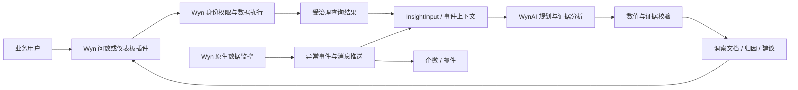
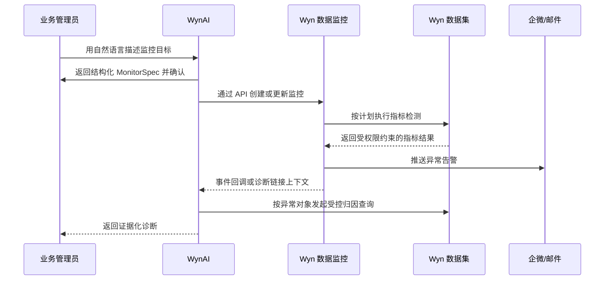
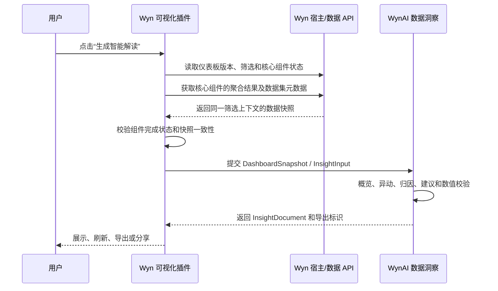

# 周黑鸭 AI 需求 POC 总体方案与落地跟踪

> 文档状态：初步方案基线  
> 更新日期：2026-09-28  
> 需求来源：`BI自主分析平台_POC测试用例包_WYN.xlsx` 的“测试用例”工作表，`POC_E_01` 至 `POC_E_05`  
> 适用范围：周黑鸭 AI 洞察 POC 的方案评审、开发排期、联调、验收和问题跟踪

## 1. 执行结论

当前判断可以概括为：

1. **E_01 至 E_04 已完成初步能力匹配和总体方案设计**，已经可以进入接口确认、数据准备和任务拆分阶段，但尚不能标记为“已实施”或“已通过客户验收”。
2. **E_05 已具备主要实现基础**。当前 Smart Query 受控 WAX 链路会在非用户主动限量的结果超过 `20,000` 行时拒绝继续处理，返回可读的 `422` 错误，并且不会截取部分结果继续计算。
3. **E_05 的剩余差距不只是把 20,000 改成 100,000**。还需要明确阈值作用对象、实现配置化、验证边界值，并证明连续超限后服务和其他看板仍然可用。
4. **E_02 与 Wyn 原生数据监控结合是合理且优先的方案**。Wyn 负责定时检测、灵敏度、告警去重和企微/邮件推送，WynAI 负责监控配置辅助、告警上下文组装和后续智能归因。
5. **E_03 应落地为“有证据的贡献归因”，不宣称统计因果**。平台按品类、时段、客流等维度拆解变化、计算贡献并排序；证据不足时必须返回“未找到显著主因”。
6. **E_04 采用“Wyn 仪表板插件 + WynAI 数据洞察”联合方案可行**。插件适合作为用户入口和快照触发器，但不应把“监听所有网络请求”当成唯一数据获取机制。优先使用 Wyn 官方插件/宿主数据 API；网络请求捕获只作为经过版本验证的兼容方案。

### 1.1 状态定义

| 状态 | 含义 |
| --- | --- |
| 已有能力 | 当前代码或 Wyn 产品已有可复用能力，并有代码或既有验证证据 |
| 方案已形成 | 已明确系统边界、核心流程和验收方式，但尚未完成客户环境实施 |
| 待确认 | 依赖 Wyn API、客户数据、权限或业务口径确认 |
| 待实施 | 需要开发、配置或联调 |
| 自动化通过 | 已有与本需求直接对应的自动化验证 |
| 真实 UAT 通过 | 已在周黑鸭 POC 环境以真实用户、真实数据和真实浏览器通过 |
| 正式启用 | 已完成上线审批、监控和运维交接 |

## 2. 需求与匹配度总览

| 用例 | 客户目标 | 当前匹配度 | 当前状态 | 主要缺口 |
| --- | --- | --- | --- | --- |
| E_01 自然语言问数 | 20 题准确率不低于 85%，诱导题零编造 | 高 | 已有能力，方案已形成 | DS-7 语义配置、周黑鸭 20 题专项 UAT、真实终端用户权限验证 |
| E_02 异常识别与预警 | 销售额/动销率异常识别、灵敏度、企微/邮件推送 | 中高 | 联合方案已形成，接口待确认 | Wyn 监控 API、事件回调、通知配置和权限模型需确认 |
| E_03 异常归因 | 品类/时段/客流拆解、主因排序、数值可验证 | 中 | 技术组件部分具备，方案已形成 | 通用维度选择、贡献对账、显著性规则和无主因路径待实施 |
| E_04 看板智能解读 | 概览/异动/归因/建议，抽查数值零误差，可导出分享 | 中高 | 数据洞察已有，集成方案已形成 | 仪表板快照协议、插件采集、元数据映射、跨组件完整性待实施 |
| E_05 超限熔断 | 超限阻断、可读提示、阈值可配置、服务保持可用 | 高 | 20,000 行硬限制已有 | 阈值配置化、100,000 行目标评估、阈值口径和稳定性 UAT |

匹配度表示技术基础与目标方案的接近程度，不等同于完成度。

## 3. 总体架构

### 3.1 系统分工原则

- **Wyn 负责受治理的数据执行**：身份、数据权限、数据集查询、聚合、仪表板运行和原生数据监控。
- **WynAI 负责 AI 分析编排**：自然语言理解、语义规划、证据校验、贡献归因、综合解读、报告生成和审计。
- **不在 WynAI 本地重建 Wyn 查询结果**，不使用业务字段硬编码，不把抽样或截断结果描述为全量结论，不在失败时生成无证据的业务答案。
- **所有数值结论必须可回到结果集和查询上下文**，权限不足、数据不完整或证据不足时显式停止或降级。



### 3.2 跨系统职责矩阵

| 能力 | Wyn | WynAI | 客户/项目组 |
| --- | --- | --- | --- |
| 用户身份和数据权限 | 主责 | 透传并校验上下文 | 提供角色与账号矩阵 |
| 数据查询和聚合 | 主责 | 生成受控业务意图，不直接拼接任意查询 | 提供数据集和标准答案 |
| 指标异常检测 | 主责 | 可辅助生成监控配置 | 确认指标、频率和灵敏度 |
| 企微/邮件推送 | 主责 | 提供诊断链接或摘要 | 提供接收人和渠道配置 |
| 异常归因 | 提供受治理结果 | 主责 | 复核业务解释 |
| 看板数据快照 | 提供插件/宿主 API 和查询结果 | 定义输入协议并接收 | 指定核心看板和核心组件 |
| 综合智能解读 | 提供数据与上下文 | 主责 | 复核可用性和行动建议 |
| 审计与验收 | 提供查询/监控日志 | 提供 trace、证据和生成记录 | 签署验收结论 |

## 4. E_01 自然语言问答式数据查询

### 4.1 客户验收要求

- 使用 DS-7 的 20 道问题及 SQL 标准答案逐题验证。
- 正确题数不少于 17 题，准确率不低于 85%。
- 对不存在指标或越权问题明确拒答并说明原因，不能编造。
- 记录单题耗时。

### 4.2 可复用能力

- Smart Query 已具备自然语言到业务意图、受控查询和结构化结果的主链路。
- 当前 `smart-query` 执行策略要求 Wyn 负责筛选、分组、聚合和排序，拒绝样本结果与业务 fallback。
- 现有销售数据集发布门禁有 `52/52` API 和真实浏览器验证记录，可证明平台链路具备较强基础。
- 该 `52/52` 结果来自另一套销售数据集和 Skill，**不能替代周黑鸭 DS-7 的 20 题验收**。

### 4.3 POC 落地方案

1. 导入 DS-7 数据集元数据，确认日期、区域、门店、品类、SKU、销售额、销量、动销率等业务定义。
2. 建立周黑鸭专用但机制通用的语义目录/Skill，包括字段别名、指标口径、枚举值、时间口径和不可用能力。
3. 把 20 道标准问题冻结为 POC 评测集，逐题记录：识别意图、Wyn 查询、结果、标准答案、误差、耗时和 trace。
4. 增加不存在指标、无权限字段、无权限门店和无数据结果用例。
5. 使用真实 POC 角色账号验证权限穿透。服务身份可查询成功不等于终端用户权限已经验证。

### 4.4 完成标准

- [ ] 20 题中至少 17 题与标准答案一致。
- [ ] 所有诱导题均明确拒答，零编造。
- [ ] 每题保留查询计划、Wyn 执行证据、结果和耗时。
- [ ] 至少覆盖一个受限角色，并验证其无法访问无权限数据。
- [ ] 页面结果、导出结果和 API 结果一致。

## 5. E_02 指标数据异常智能识别与预警

### 5.1 可行性结论

将 Wyn 原生数据监控与 WynAI 结合是可行的，也是推荐架构。异常识别、调度、灵敏度和消息推送属于 BI 平台原生运行能力，应由 Wyn 承担；WynAI 不需要重复建设调度器和通知系统。

### 5.2 目标流程



### 5.3 职责边界

| 环节 | 实现方 | 说明 |
| --- | --- | --- |
| 监控规则创建/修改/停用 | Wyn API，WynAI 辅助配置 | 用户确认后才写入；保留规则 ID 和版本 |
| 调度和检测 | Wyn | 使用 Wyn 原生调度与数据权限 |
| 灵敏度 | Wyn | 阈值、同比/环比窗口、连续触发次数、冷却时间 |
| 误报抑制 | Wyn | 去重、冷却、最低业务量、静默窗口 |
| 消息渠道 | Wyn | 企微、邮件及接收人管理 |
| 异常解释 | WynAI | 使用异常发生时的指标、对象、期间和基线发起 E_03 |
| 审计 | 双方 | 监控执行记录、告警事件、AI 诊断 trace 关联 |

### 5.4 必须确认的 Wyn 接口

- [ ] 监控规则的创建、读取、更新、停用和删除 API。
- [ ] 支持的检测类型和灵敏度参数。
- [ ] 监控执行历史与异常事件查询 API。
- [ ] 是否支持 webhook/事件回调，以及回调签名和重试策略。
- [ ] 企微/邮件渠道和接收人配置 API。
- [ ] 创建者、执行身份、数据权限和管理员权限的关系。
- [ ] 告警去重、冷却、失败重试和消息投递状态。

若 Wyn 暂无异常事件回调，POC 首选在告警中附加“查看 AI 诊断”链接，由用户按需触发 E_03；定时轮询事件历史只作为次选方案。

### 5.5 完成标准

- [ ] “门店销售额突降 30%”和“品类动销率骤升”均被识别。
- [ ] 调整灵敏度后，正常波动的误报可被抑制。
- [ ] 企微或邮件消息包含指标、对象、期间、变化幅度、规则和诊断入口。
- [ ] 事件能定位到门店或品类级，并能关联到唯一监控执行记录。
- [ ] 通知失败不会丢失异常事件，可查询失败原因并重试。

## 6. E_03 数据异常智能归因分析

### 6.1 落地定位

POC 阶段应把“归因”定义为**基于可观测数据的贡献拆解和主因排序**，而不是未经实验或统计识别的因果结论。输出可以说“主要拖累项”“贡献最大”，不能无证据地说“导致”“造成”。

### 6.2 可复用能力

- 已有增长来源规划和贡献计算基础，可按期间比较、区域和类别生成下钻查询及证据。
- 已有 Evidence Pack、Critic、Narrator 和数值声明校验。无有效证据引用、引用范围越界或数字无法由证据支持的句子会被拒绝。
- 当前增长来源实现仍偏向固定的“区域/类别/月度”模式，尚未直接覆盖周黑鸭要求的品类、时段、客流以及任意异常对象。

### 6.3 目标分析流程

1. **确认异常**：读取 E_02 异常事件，固定指标、门店、异常期间、对比基线和变化幅度。
2. **建立对账基线**：分别查询当前期与基准期总值，确认异常幅度可复现。
3. **选择候选维度**：根据数据集元数据和 Skill 选择品类、时段、客流等可用维度，不能按字段名硬编码。
4. **维度贡献拆解**：对每个候选维度计算 `当前值 - 基准值`，并计算其对总变化的贡献。
5. **对账**：各分组变化之和应与同口径总变化一致；不一致时停止主因结论并报告数据完整性问题。
6. **主因排序**：按与异常方向一致的绝对贡献排序，同时保留反向抵消项。
7. **显著性判断**：按配置的最低贡献额、贡献占比、数据覆盖和稳定性条件判断是否存在显著主因。
8. **生成结论**：所有数字绑定 evidence ID；证据不足或没有显著项时返回“未找到显著主因”。

### 6.4 建议的显著主因规则

以下规则需要客户确认，不能在 POC 中写死为平台通用真理：

- 贡献方向与总体异常方向一致。
- 贡献绝对值达到最低业务量阈值。
- 贡献占总体变化的比例达到约定阈值。
- 当前期和基准期数据覆盖完整，且不是样本或截断结果。
- 若多个维度解释的是同一批记录，分别展示，不把跨维度贡献相加。

### 6.5 输出结构

- 异常确认：对象、指标、期间、基线、变化值和变化率。
- 主因排序：维度、成员、当前值、基准值、变化值、贡献占比。
- 反向因素：抵消异常的主要分组。
- 限制说明：缺失维度、数据覆盖、口径差异或证据不足。
- 结论状态：`已找到显著主因`、`未找到显著主因` 或 `数据不足无法判断`。

### 6.6 完成标准

- [ ] 支持对单个门店异常按品类、时段和客流拆解；缺失维度时明确说明。
- [ ] 当前期、基准期、变化值和贡献值均可回查到 Wyn 结果。
- [ ] 分组变化与总变化完成同口径对账。
- [ ] 主因排序方向正确，抽查数值误差为 0。
- [ ] 无显著主因时输出规定文案，不生成勉强结论。
- [ ] 不把相关性或贡献度描述为因果关系。

## 7. E_04 看板智能解读

### 7.1 方案结论

整体方向合理：把 Wyn 仪表板在某一时刻的受治理查询结果作为数据洞察模块的输入，由 WynAI 生成跨组件的综合解读。建议把插件定义为**解读入口、上下文采集器和结果展示器**，把数据采集封装为独立的宿主适配层。

### 7.2 为什么不能只依赖监听网络请求

当前项目确实已有一个视图代理，按 `viewId` 捕获特定的 `data-insight` 请求和 `/pivot` 响应，并转换为数据洞察输入。这证明“基于 Wyn 查询结果接入数据洞察”已经有技术基础，但不等于任意仪表板插件都能稳定获取所有兄弟组件的数据。

仅监听网络请求存在以下风险：

- 插件运行沙箱、iframe、浏览器安全策略可能阻止拦截其他组件请求。
- 部分组件可能使用缓存、批处理、WebSocket 或不同版本的接口。
- 首屏请求、筛选后请求和异步刷新完成时间不同，容易得到不一致快照。
- 网络响应通常缺少完整的业务语义、显示格式、组件标题和筛选来源。
- Wyn 升级后私有接口路径或载荷结构可能变化。

因此数据获取优先级为：

1. Wyn 官方插件/宿主 API 获取仪表板、组件、筛选状态、数据和元数据。
2. Wyn 官方查询或导出 API 按组件重新获取一致结果。
3. 对明确接口做白名单网络捕获，作为版本绑定的兼容层，并保留契约测试。

### 7.3 目标流程



### 7.4 POC 范围建议

- 选择 1 张门店经营看板和 4–8 个核心可视化组件。
- 首期只接收聚合结果，不抓取大规模明细。
- 每次生成前冻结仪表板版本、全局筛选、组件筛选和刷新时间。
- 对未加载、失败、无权限或超限组件显示明确状态，不静默忽略。
- 将组件标题、指标定义、维度、单位和显示格式随结果一起提交。

当前 `InsightInput v1` 一次最多接收 8 个结果集，每个结果集最多 20,000 行，适合上述 POC 范围。当前 Wyn 查询适配器会根据字段名推断指标角色；正式接入时必须改为使用真实数据集和查询元数据，避免把字段名猜测当成业务语义。

### 7.5 解读输出映射

| 客户要求 | WynAI 输出 |
| --- | --- |
| 概览 | 管理摘要、核心指标和总体趋势 |
| 异动 | 关键发现、异常点和风险判断 |
| 归因 | 复用 E_03 的贡献拆解及证据 |
| 建议 | 与已验证发现共享证据的行动建议 |
| 导出/分享 | InsightDocument 的导出、版本和分享能力 |

### 7.6 完成标准

- [ ] 插件能够识别仪表板、版本、当前用户、全局筛选和 4–8 个核心组件。
- [ ] 所有组件数据属于同一筛选和刷新快照；不一致时阻止生成并提示刷新。
- [ ] 输出覆盖概览、异动、归因和建议；无明显特征时明确说明。
- [ ] 随机抽查 5 个引用数值，与组件展示或 Wyn 查询结果误差为 0。
- [ ] 缺失、失败、无权限和超限组件均在解读中披露。
- [ ] 解读可导出和分享，并保留仪表板版本、筛选及生成 trace。
- [ ] Wyn 目标版本升级后，数据采集契约测试仍通过。

## 8. E_05 AI 抓取数据量超限熔断

### 8.1 已有能力

- `ControlledWaxAdapter` 声明 `maximumRows: 20000`。
- 对投影/明细请求会先获取完整计数；非用户主动限量且匹配行数超过 20,000 时，返回 `QUERY_RESULT_EXCEEDS_LIMIT` 和可读提示，要求缩小筛选范围。
- 对聚合结果超过限制的情况同样阻断。
- 结果归一化层再次检查返回行数或可验证总行数，超过 20,000 时拒绝继续计算。
- 平台不会把前 20,000 行当作全量数据生成业务结论。

### 8.2 与客户要求的差距

1. 当前阈值为代码中的固定 `20,000`，客户用例要求“阈值可配置”，并给出 `100,000` 行示例。
2. 必须明确阈值针对哪一层：源数据匹配行数、Wyn 返回结果行数、聚合分组数，还是发给 AI 的载荷行数。这几个概念不能共用一个模糊配置。
3. 把阈值提高到 100,000 前，需要评估 Wyn 查询、Node.js 内存、序列化、网络、Evidence Pack 和 LLM 输入预算，不能只改常量。
4. 需要证明超限后 AI 服务、后续正常问数和其他 Wyn 看板不受影响。

### 8.3 建议配置

| 配置 | 作用 | POC 建议 |
| --- | --- | --- |
| `query.maxMatchedRows` | 明细/投影查询允许匹配的最大源端行数 | 默认 20,000；评估后再试 100,000 |
| `query.maxReturnedRows` | Wyn 返回平台的最大结果行数/分组数 | 默认 20,000 |
| `insight.maxRowsPerResultSet` | 单个 InsightInput 结果集最大行数 | 当前 20,000 |
| `insight.maxResultSets` | 一次洞察最多结果集数 | 当前 8 |
| `query.timeoutMs` | 查询超时 | 保持独立配置，不与行数混用 |

配置应支持全局默认值和 POC 环境覆盖，并设置硬上限，禁止普通用户任意提高。

### 8.4 完成标准

- [ ] 超限请求 100% 在受控边界被阻断，不下载或本地计算全量明细。
- [ ] 返回“数据量超限”和缩小时间、门店、品类或维度范围的可执行建议。
- [ ] 阈值修改有权限控制、审计记录并可恢复默认值。
- [ ] 验证 `阈值 - 1`、`阈值` 和 `阈值 + 1` 三个边界。
- [ ] 连续执行多次超限请求后，正常问数仍成功。
- [ ] 超限测试期间其他 Wyn 看板保持可用。
- [ ] 若采用 100,000 行阈值，提供性能、内存和超时证据。

## 9. 共享接口契约

以下为方案级草案，字段名和版本需在开发前冻结。

### 9.1 MonitorSpec

```json
{
  "schema": "wynai.monitor-spec/v1",
  "datasetId": "dataset-id",
  "metric": { "field": "sales_amount", "aggregation": "sum" },
  "scope": { "dimensions": ["store_id"], "filters": [] },
  "schedule": { "frequency": "daily", "timezone": "Asia/Shanghai" },
  "detector": {
    "type": "period-change",
    "baseline": "previous-period",
    "direction": "decrease",
    "thresholdPercent": 30,
    "minimumVolume": null
  },
  "notification": {
    "channels": ["wecom", "email"],
    "recipients": [],
    "cooldownMinutes": 60
  }
}
```

### 9.2 AnomalyEvent

```json
{
  "schema": "wynai.anomaly-event/v1",
  "eventId": "event-id",
  "monitorId": "wyn-monitor-id",
  "occurredAt": "2026-09-28T00:00:00Z",
  "datasetId": "dataset-id",
  "metric": "sales_amount",
  "entity": { "store_id": "store-id" },
  "period": { "current": "2026-09-27", "baseline": "2026-09-20" },
  "observed": { "current": 0, "baseline": 0, "delta": 0, "deltaPercent": -30 },
  "ruleVersion": "1",
  "permissionContextRef": "permission-context-id",
  "wynExecutionRef": "wyn-execution-id"
}
```

### 9.3 DashboardSnapshot

```json
{
  "schema": "wynai.dashboard-snapshot/v1",
  "dashboard": { "id": "dashboard-id", "version": "version-id", "title": "门店经营看板" },
  "capturedAt": "2026-09-28T00:00:00Z",
  "actor": { "id": "user-id", "organizationId": "org-id" },
  "filters": [],
  "components": [
    {
      "id": "visual-id",
      "title": "销售趋势",
      "status": "complete",
      "datasetId": "dataset-id",
      "queryRef": "query-id",
      "resultSetId": "result-set-id",
      "metadata": { "metrics": [], "dimensions": [], "units": [] }
    }
  ],
  "consistency": { "sameFilterState": true, "allCoreComponentsComplete": true }
}
```

### 9.4 到 InsightInput 的映射

- 每个核心组件映射为一个 `resultSet`。
- 仪表板 ID、版本、筛选状态和捕获时间进入 `context`。
- 数据集 ID 和版本进入 `datasets`。
- 组件查询引用、Wyn 执行 ID 和来源进入 `evidence`。
- 组件未完成、截断、抽样或无权限状态进入 `quality`，不能在转换时丢失。
- 转换完成后由现有 `InsightInput v1` 校验器做结构和行数校验。

## 10. 权限、安全、隐私与审计

- 查询和监控执行必须绑定真实用户或明确的服务身份，不能因为进入 AI 链路扩大数据权限。
- 仪表板插件只能读取当前用户在当前看板可见的数据和元数据。
- 默认传递聚合结果；明细和敏感字段遵循最小化原则，并在进入 LLM 前执行脱敏策略。
- 所有请求记录用户、组织、数据集、看板、筛选、规则版本、查询计划、Wyn 执行引用和 AI trace。
- 任一组件无权限时，不用其他组件推断或补齐其内容。
- 抽样、截断、查询失败或快照不一致时，显式披露并限制结论范围。
- LLM 不得生成查询语言、绕过受控执行器或构造业务 fallback。
- 导出和分享继承原洞察的访问控制，并记录访问和下载审计。

## 11. 分阶段实施计划

### 阶段 0：前置确认与基线冻结

- 获取 DS-7、DS-8、A 系列看板和 POC 账号。
- 冻结指标口径、标准答案、权限矩阵和验收记录模板。
- 获取 Wyn 数据监控 API、可视化插件 API 和目标版本说明。
- 确认企微/邮件环境以及是否允许 webhook。

退出条件：所有依赖有负责人和预计完成时间；未确认项不会被误标为产品能力。

### 阶段 1：E_01 与 E_05 基线

- 完成周黑鸭 Skill/语义配置和 20 题自动化评测。
- 完成诱导题、权限题和零结果用例。
- 把行数限制改为受治理配置，并完成边界与连续超限测试。

退出条件：E_01 达到 17/20 且零编造；E_05 超限阻断和服务恢复通过。

### 阶段 2：E_02 Wyn 数据监控联调

- 完成 MonitorSpec 到 Wyn API 的映射。
- 创建销售额和动销率监控规则。
- 完成异常注入、灵敏度调整和消息渠道验证。

退出条件：两类异常识别并推送，事件可追踪，误报可调。

### 阶段 3：E_03 通用贡献归因

- 把固定区域/类别增长来源逻辑泛化为元数据驱动的候选维度。
- 增加品类、时段、客流拆解、贡献对账和显著性判断。
- 增加“未找到显著主因”和“数据不足无法判断”路径。

退出条件：异常主因排序可复核，抽查数值误差为 0，无主因用例不编造。

### 阶段 4：E_04 仪表板插件与数据洞察集成

- 冻结 DashboardSnapshot 和映射契约。
- 完成插件入口、组件采集、快照一致性和状态展示。
- 接入数据洞察，复用 E_03 结果，完成导出与分享。

退出条件：目标看板结构完整，5 个抽查数值误差为 0，可导出分享。

### 阶段 5：端到端 POC 验收

- 运行 E_01 至 E_05 全套用例。
- 使用真实账号、真实浏览器、真实企微/邮件和真实 Wyn 环境。
- 汇总失败项、限制、性能、日志和可恢复性证据。

退出条件：客户测试表逐项签署，遗留项有书面处理结论。

## 12. 可跟踪任务清单

| ID | 任务 | 当前状态 | 建议负责人 | 前置依赖 | 验收证据 |
| --- | --- | --- | --- | --- | --- |
| POC-001 | 冻结 DS-7 20 题、SQL 答案和判分规则 | 待确认 | 客户数据团队/POC 负责人 | DS-7 | 版本化题库 |
| POC-002 | 建立周黑鸭数据集语义目录和 Skill | 待实施 | WynAI | POC-001 | 字段/指标/枚举映射 |
| POC-003 | 执行 E_01 API 自动化评测 | 待实施 | WynAI | POC-002 | 20 题结果与 trace |
| POC-004 | 执行 E_01 真实浏览器和权限 UAT | 待实施 | 联合 | POC-003、账号矩阵 | 截图、日志、权限证据 |
| POC-005 | 获取并评审 Wyn 数据监控 API | 待确认 | Wyn 产品/R&D | API 文档 | 能力矩阵和示例请求 |
| POC-006 | 实现 MonitorSpec 到 Wyn 监控规则映射 | 待实施 | WynAI/Wyn R&D | POC-005 | 契约测试 |
| POC-007 | 完成 DS-8 异常注入和通知联调 | 待实施 | 联合 | POC-006、通知环境 | 监控历史、企微/邮件证据 |
| POC-008 | 定义 E_03 候选维度和显著性规则 | 待确认 | 客户业务/WynAI | 指标口径 | 评审记录 |
| POC-009 | 泛化贡献归因规划与计算 | 待实施 | WynAI | POC-008 | 自动化测试和对账证据 |
| POC-010 | 实现无显著主因/数据不足路径 | 待实施 | WynAI | POC-009 | 负向用例 |
| POC-011 | 确认 Wyn 插件/宿主数据 API | 待确认 | Wyn 产品/R&D | 目标 Wyn 版本 | API 能力矩阵 |
| POC-012 | 冻结 DashboardSnapshot/InsightInput 映射 | 方案已形成 | 联合 | POC-011 | JSON Schema 和样例 |
| POC-013 | 开发仪表板插件与快照采集适配层 | 待实施 | Wyn 插件/WynAI | POC-012 | 插件包、契约测试 |
| POC-014 | 完成 E_04 综合解读、导出和分享 | 待实施 | WynAI | POC-009、POC-013 | 5 个数值核对和导出件 |
| POC-015 | 明确 E_05 四类限制口径 | 待确认 | 架构/WynAI | 性能目标 | 配置说明 |
| POC-016 | 实现限制配置化和权限控制 | 待实施 | WynAI | POC-015 | 配置与审计测试 |
| POC-017 | 执行 E_05 边界、连续超限和可用性 UAT | 待实施 | 测试/联合 | POC-016 | 性能、内存、服务日志 |
| POC-018 | 执行 E_01–E_05 客户联合验收 | 待实施 | POC 负责人 | 前述任务 | 签署版测试记录 |

## 13. 风险与待决策事项

| 风险/决策 | 影响 | 建议处理 |
| --- | --- | --- |
| Wyn 数据监控 API 能力尚未确认 | E_02 自动创建和事件联动可能受限 | 先获取 API 清单；无回调时采用告警诊断链接 |
| 插件无法直接读取其他组件数据 | E_04 快照不完整 | 优先官方宿主 API；必要时使用服务端白名单捕获 |
| 私有网络接口随 Wyn 升级变化 | E_04 兼容性风险 | 绑定目标版本并建立契约回归测试 |
| 仪表板组件刷新时点不一致 | 解读数字互相矛盾 | 引入快照 ID、过滤状态哈希和完成状态门禁 |
| 业务“归因”被理解为因果判断 | E_03 结论被过度使用 | 在产品和验收文案中固定为贡献拆解 |
| 品类、时段、客流存在交叉重叠 | 跨维度贡献可能重复计算 | 各维度独立展示，不跨维度求和 |
| 20,000 提升到 100,000 带来资源压力 | 查询、内存和 LLM 预算失控 | 分层限制；优先源端聚合，完成压测后再提高 |
| 服务账号与真实用户权限不一致 | 可能形成越权 | E_01/E_04 必须使用真实受限账号做 UAT |
| 客户数据口径或标准答案变化 | 准确率不可复现 | 冻结数据集版本、题库版本和指标口径 |

### 13.1 需要尽快决定的问题

- [ ] POC 的 E_05 阈值目标是保持 20,000，还是必须演示 100,000？
- [ ] 阈值针对匹配明细行、返回结果行、聚合分组还是 AI 输入行？
- [ ] E_02 是否要求从 WynAI 自动创建监控，还是在 Wyn 中人工配置即可通过 POC？
- [ ] Wyn 是否提供异常事件 webhook；若没有，是否接受告警中的按需诊断链接？
- [ ] E_04 指定哪一张看板、哪些核心组件和哪个 Wyn 版本？
- [ ] E_03 的显著贡献阈值和最低业务量由谁确认？
- [ ] 导出/分享需要 PDF、HTML、链接还是 Wyn 内部分享？

## 14. POC 完成定义

只有同时满足以下条件，单项用例才能标记为“真实 UAT 通过”：

- 使用周黑鸭指定数据集、指定 Wyn 版本和指定测试账号。
- 自动化检查和真实浏览器流程均完成，且结果一致。
- 每个数值结论均可追溯到 Wyn 查询结果和对应 evidence ID。
- 权限不足、超限、无数据、无显著主因和组件失败等负向路径均有可读结果。
- 不存在业务字段硬编码、样本冒充全量、截断后继续计算、本地重建 Wyn 结果或业务 fallback。
- 保存 API 请求/响应摘要、trace、Wyn 执行引用、截图、导出件和测试记录。
- 已知限制和未通过项有明确负责人、处理方式和客户确认。

## 15. 当前项目证据索引

| 能力证据 | 位置 | 说明 |
| --- | --- | --- |
| InsightInput 限制 | `lib/data-insights/insight-input.mjs` | 最多 8 个结果集，单结果集最多 20,000 行 |
| Wyn 查询结果适配 | `lib/data-insights/wyn-query-adapter.mjs` | 已能把特定 Wyn 查询结果转换为 InsightInput |
| 视图代理捕获 | `server.mjs` | 按 viewId 捕获特定 data-insight 请求和 pivot 响应 |
| 增长来源规划 | `lib/planning/hypothesis-planner.mjs` | 已有期间变化的区域/类别下钻基础 |
| 贡献分析 | `lib/analytics/growth-driver.mjs` | 已有变化贡献、反向项和 evidence 生成基础 |
| 数值证据校验 | `lib/data-insights/llm-orchestrator.mjs` | 拒绝无证据引用和无法验证的数字声明 |
| 20,000 行硬限制 | `lib/query/adapters/controlled-wax.mjs`、`lib/query/result-normalizer.mjs` | 超限返回 422，不截取后继续计算 |
| 项目验证基线 | `DEVELOPMENT_PROGRESS_REPORT.md` | 记录现有销售数据集 52/52 门禁及当前开发状态 |

这些证据用于判断当前技术基础，不能替代周黑鸭 POC 的专项验收。

## 16. 变更记录

| 日期 | 版本 | 变更 |
| --- | --- | --- |
| 2026-09-28 | v0.1 | 基于 E_01–E_05 需求形成总体方案、系统边界、任务清单和验收定义 |
