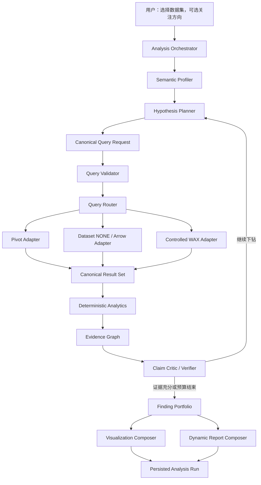
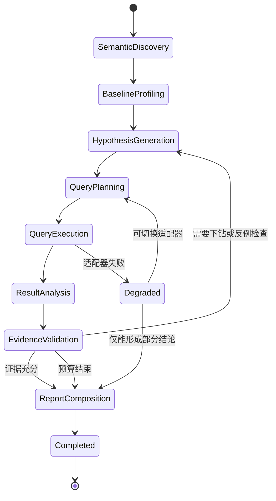

# Wyn 自主数据分析智能体 V2 产品设计文档

> 文档状态：Draft for Implementation  
> 版本：2.0  
> 更新日期：2026-08-01  
> 关联需求：[PRODUCT_REQUIREMENTS_V2.md](./PRODUCT_REQUIREMENTS_V2.md)

> 实施状态说明：本文档描述的是目标架构。当前 V2.0 仅落地查询契约、路由、标准结果集和确定性第二轮下钻；Planner—Executor—Critic 的自主闭环按 [PRODUCT_DESIGN_V2_1.md](./PRODUCT_DESIGN_V2_1.md) 继续实施。

## 1. 设计目标

本设计将现有“固定查询计划 + 固定分析程序 + LLM 报告生成”原型升级为一个能够自主规划、动态查询、逐层下钻、验证结论并动态生成报告的数据分析 Harness。

核心目标是实现三个层次的彻底解耦：

1. **查询需求层**：描述分析需要什么数据和为什么需要。
2. **查询执行层**：决定通过哪种接口、协议和计算位置获得数据。
3. **查询结果层**：将不同执行通道的输出统一为标准结果集。

该设计使 Pivot、Dataset NONE、WAX、Arrow、本地算法或未来的数据模型查询都可以独立演进，不限制上层 AI 的分析思路。

## 2. 设计边界

### 2.1 本次设计覆盖

- 单个 Wyn 数据集的自主分析。
- 数据集元数据、业务语义和字段能力建模。
- 查询需求、查询执行、标准结果集三层契约。
- Pivot 候选、Dataset NONE 和 WAX 三类查询适配器。
- 宏观聚合、交叉下钻、按需明细和本地数据挖掘。
- 多轮分析 Harness、假设管理、证据图谱和结论验证。
- 动态可视化和动态报告。
- 查询治理、预算、审计、失败降级和运行持久化。

### 2.2 本次设计不覆盖

- 任意数据源 SQL。
- 未治理的跨源 JOIN。
- 自动执行经营动作。
- 通用 AutoML 平台。
- 把未验证的 Wyn 内部接口作为唯一执行通道。

## 3. 关键架构决策

| 编号 | 决策 | 理由 |
| --- | --- | --- |
| AD-001 | AI 只生成平台无关的结构化分析意图 | 避免与 WAX、Pivot 或其他协议耦合。 |
| AD-002 | 查询意图必须先校验再执行 | 防止字段越权、表达式注入和失控查询。 |
| AD-003 | 使用查询路由器选择执行适配器 | 不同分析阶段需要不同数据形态和计算位置。 |
| AD-004 | Pivot 在协议验证通过后作为优先聚合适配器 | 复用 Wyn 结构化多维查询能力，同时避免过早依赖内部协议。 |
| AD-005 | Dataset NONE/Arrow 用于明细和算法输入 | 支持客户分群、复购、异常和组合分析。 |
| AD-006 | WAX 保留为受控适配器和兼容回退 | 保留完整数据集服务端聚合能力，但不暴露原始表达式入口。 |
| AD-007 | 所有适配器输出统一标准结果集 | 分析和报告不感知底层查询方式。 |
| AD-008 | 使用多轮 Planner—Executor—Critic Harness | 支持根据结果继续下钻、寻找反例和决定停止。 |
| AD-009 | 使用结论—证据图谱而非简单 evidenceId 列表 | 校验指标、维度、时间和过滤范围是否真正支持结论。 |
| AD-010 | 报告与图表由发现驱动 | 移除固定五类洞察、三张图和四段报告结构。 |

## 4. 总体架构



## 5. 核心领域对象

### 5.1 AnalysisRun

一次完整自主分析的根对象。

```json
{
  "id": "run-id",
  "version": "analysis-run/v2",
  "dataset": {
    "id": "dataset-id",
    "revision": "revision-id"
  },
  "focus": "可选关注方向",
  "constraints": {},
  "status": "planning|running|completed|partial|failed|cancelled",
  "budget": {},
  "hypotheses": [],
  "queries": [],
  "resultSets": [],
  "evidenceGraph": {},
  "findings": [],
  "visualizations": [],
  "report": {},
  "audit": {}
}
```

### 5.2 Hypothesis

表示一个待验证的业务问题，而不是预设结论。

```json
{
  "id": "hyp-growth-driver",
  "question": "近期销售增长主要由价格、数量还是结构变化驱动？",
  "businessValue": "判断增长质量和可持续性",
  "priority": 0.92,
  "status": "candidate|testing|supported|rejected|inconclusive",
  "requiredEvidence": [
    "period revenue and quantity",
    "product/category mix",
    "profit and margin"
  ],
  "parentHypothesisId": null,
  "generatedBy": "sales-analysis-skill",
  "stopReason": null
}
```

### 5.3 CanonicalQueryRequest

平台无关的查询需求对象。该对象中禁止出现 WAX、SQL 或原始 Pivot Payload。

```json
{
  "id": "qry-growth-region-category",
  "hypothesisId": "hyp-growth-driver",
  "purpose": "验证最近一个月增长的区域和类别来源",
  "mode": "aggregate",
  "dataset": {
    "id": "dataset-id",
    "revision": "revision-id"
  },
  "select": [
    { "field": "订购日期", "role": "dimension", "grain": "month" },
    { "field": "客户地区", "role": "dimension" },
    { "field": "类别名称", "role": "dimension" }
  ],
  "measures": [
    { "field": "订单金额", "aggregation": "sum", "alias": "revenue" },
    { "field": "订单利润", "aggregation": "sum", "alias": "profit" },
    {
      "formula": "profit / revenue",
      "alias": "margin",
      "resultType": "percentage"
    }
  ],
  "filters": [],
  "comparison": {
    "type": "period_over_period",
    "current": "latest_complete_period",
    "baseline": "previous_period"
  },
  "orderBy": [
    { "field": "revenue", "direction": "desc" }
  ],
  "limit": 1000,
  "expectedResult": {
    "shape": "table",
    "maximumRows": 1000
  },
  "sensitivity": "aggregate-only"
}
```

### 5.4 QueryExecutionPlan

由查询路由器生成，记录具体执行方式，但不改变原始查询需求。

```json
{
  "requestId": "qry-growth-region-category",
  "adapter": "wyn-pivot",
  "adapterVersion": "candidate-v1",
  "fallbackAdapters": ["wyn-wax", "dataset-none-local"],
  "compiledPayloadHash": "sha256:...",
  "timeoutMs": 30000,
  "rowLimit": 1000,
  "cachePolicy": "dataset-revision-and-query-fingerprint",
  "permissionContext": "server-identity-claims",
  "status": "ready"
}
```

运行记录可以保存脱敏后的 Payload 摘要和哈希，但不得保存 Token、用户密钥或敏感身份声明。

### 5.5 CanonicalResultSet

所有查询适配器必须转换为相同结果结构。

```json
{
  "id": "rs-growth-region-category",
  "requestId": "qry-growth-region-category",
  "schema": [
    { "name": "month", "type": "date", "role": "dimension" },
    { "name": "region", "type": "string", "role": "dimension" },
    { "name": "category", "type": "string", "role": "dimension" },
    { "name": "revenue", "type": "number", "role": "measure" },
    { "name": "profit", "type": "number", "role": "measure" },
    { "name": "margin", "type": "number", "role": "derived-measure" }
  ],
  "rows": [],
  "statistics": {
    "rowCount": 0,
    "nullCounts": {},
    "minimums": {},
    "maximums": {}
  },
  "scope": {
    "datasetRevision": "revision-id",
    "filters": [],
    "timeRange": {},
    "aggregationLevel": ["month", "region", "category"]
  },
  "provenance": {
    "adapter": "wyn-pivot",
    "executedAt": "ISO-8601",
    "durationMs": 0
  },
  "quality": {
    "isSample": false,
    "isTruncated": false,
    "isEstimated": false,
    "warnings": []
  }
}
```

### 5.6 EvidenceNode

```json
{
  "id": "ev-growth-east-category",
  "hypothesisId": "hyp-growth-driver",
  "queryRequestIds": ["qry-growth-region-category"],
  "resultSetIds": ["rs-growth-region-category"],
  "calculation": {
    "method": "period contribution decomposition",
    "parameters": {}
  },
  "scope": {
    "metrics": ["订单金额"],
    "dimensions": ["订购日期", "客户地区", "类别名称"],
    "timeRange": {},
    "filters": []
  },
  "supports": [],
  "contradicts": [],
  "quality": {
    "confidence": "high",
    "limitations": []
  }
}
```

### 5.7 Finding

```json
{
  "id": "finding-growth-driver",
  "type": "fact|inference|risk|opportunity|recommendation",
  "title": "增长主要来自某区域的某类商品",
  "claim": "...",
  "evidenceIds": ["ev-growth-east-category"],
  "counterEvidenceIds": [],
  "confidence": "high",
  "verificationStatus": "verified|partial|needs-review|rejected",
  "businessImpact": "high",
  "reportPriority": 0.91
}
```

## 6. 查询需求层设计

### 6.1 查询模式

| mode | 说明 | 示例 |
| --- | --- | --- |
| `profile` | 获取字段分布、基数、日期范围和缺失情况 | 数据集基础画像 |
| `aggregate` | 单维或多维聚合 | 月份 × 区域销售额 |
| `detail` | 获取必要明细列 | 客户、订单、商品、日期 |
| `compare` | 时间、群体或场景比较 | 本期与上期、新客与老客 |
| `mining` | 为本地算法准备数据 | RFM、异常、购物篮 |
| `verify` | 对结论进行独立复算或交叉验证 | 验证增长来源 |

### 6.2 支持的语义操作

- 字段投影和必要列裁剪。
- `sum`、`count`、`distinctCount`、`min`、`max`、`average`、`median`、分位数和标准差。
- 单维与多维分组。
- 时间粒度：日、周、月、季度、年。
- 类型化过滤、组合过滤和相对时间过滤。
- 排序、TopN、BottomN 和分页。
- 同比、环比、基期比较和贡献分解。
- 派生指标和受控公式。
- 结果形状、行数和精度要求。

并非所有适配器都需要支持全部操作。路由器根据能力矩阵选择执行路径。

### 6.3 查询校验

Query Validator 依次执行：

1. 数据集是否在允许列表中。
2. 数据集版本是否仍然有效。
3. 字段是否来自当前语义目录。
4. 字段角色和数据类型是否支持请求操作。
5. 聚合和派生公式是否在白名单中。
6. 过滤值是否完成类型转换和范围检查。
7. 明细敏感字段是否允许当前用户读取。
8. 结果行数、并发数和成本估计是否在预算内。
9. 查询是否重复，能否命中缓存或复用已有结果。

## 7. 查询执行层设计

### 7.1 适配器接口

```js
class QueryAdapter {
  id;
  capabilities;

  canExecute(queryRequest, datasetCapabilities) {}
  estimate(queryRequest, datasetCapabilities) {}
  compile(queryRequest, semanticCatalog) {}
  execute(executionPlan, context) {}
  normalize(rawResult, executionPlan) {}
}
```

`compile` 只能由受信服务端代码执行。大模型不能提供可直接执行的 Payload。

### 7.2 Wyn Pivot Adapter

定位：优先承担结构化、多维、服务端聚合查询。

预期能力：

- 多指标与多维分组。
- 时间粒度。
- 过滤、排序和 TopN。
- 计算字段或服务端指标。
- 复用 Wyn 权限、缓存和查询引擎。

接入前必须完成协议验证：

1. 确认 URL、HTTP Method、Headers、认证和 CSRF 要求。
2. 确认 Payload 的正式字段定义和版本字段。
3. 验证指标、维度、聚合、过滤、排序、TopN 和时间粒度。
4. 验证两维、三维交叉分析。
5. 验证缓存数据集、直连数据集和参数化数据集。
6. 验证用户与组织上下文、行级权限和字段权限。
7. 验证错误码、超时、分页、截断和结果结构。
8. 与 Wyn 版本升级进行兼容性测试。

若 Pivot 属于未公开内部接口：

- 只能作为 feature flag 控制的增强适配器。
- 必须保留版本探测和自动禁用机制。
- 不得成为系统唯一可用查询通道。
- 生产使用前需要获得正式接口承诺或兼容说明。

### 7.3 Dataset NONE / Arrow Adapter

定位：读取受控明细和算法输入。

使用公开接口：

```http
POST /api/v2/data/datasets/{datasetId}/query
```

```json
{
  "QueryType": "NONE",
  "Query": "",
  "DatasetParameters": {},
  "Format": "Json | Arrow",
  "Options": {
    "RowLimit": "5000",
    "UnknownTypeHandle": "CastToString",
    "MissParameterHandle": "Error"
  }
}
```

适用场景：

- 小数据集全量分析。
- 数据质量和字段画像样本。
- 客户、订单、商品等必要列明细。
- RFM、复购、异常检测、相关性和购物篮算法。

限制：

- 不允许无条件拉取大规模全量明细。
- 必须有列裁剪、行数限制、时间范围或实体范围。
- 大结果优先 Arrow。
- 若公开 NONE 接口不能服务端裁剪字段，需要通过算法前置范围控制、数据集参数或其他正式接口降低传输量。

### 7.4 Controlled WAX Adapter

定位：服务端聚合兼容通道和 Pivot 不支持能力的回退。

约束：

- 仅接受 CanonicalQueryRequest。
- 仅由服务端编译 WAX。
- 大模型和浏览器不能传入原始 WAX。
- 字段、函数、聚合、过滤和结果规模全部白名单化。
- 编译后的 WAX 只在运行内短期存在；持久化时优先保存查询需求、编译器版本和哈希。

现有 [lib/wax-query.mjs](./lib/wax-query.mjs) 可作为初始适配器实现，但需要移除其中固定五类计划的职责。

### 7.5 路由规则

| 查询需求 | 首选执行 | 回退 | 说明 |
| --- | --- | --- | --- |
| 元数据与语义 | Wyn 元数据 API | 缓存目录 | 不进入数据查询适配器。 |
| 基础行数和全局 KPI | Pivot | WAX | 服务端全量聚合。 |
| 单维/多维聚合 | Pivot | WAX | 结构化请求优先。 |
| 时间 × 区域 × 类别 | Pivot | WAX | 用于增长来源验证。 |
| 小型明细数据集 | Dataset NONE JSON | NONE Arrow | 可本地确定性计算。 |
| 大型明细或算法输入 | Dataset NONE Arrow | 分段 JSON | 必须限制列与范围。 |
| RFM、复购、异常、购物篮 | 明细 + 本地算法 | 受控分段计算 | 不强求服务端表达。 |
| 结论复算 | 与原证据不同的可用适配器 | 同适配器不同查询 | 优先交叉验证。 |

### 7.6 查询预算

建议初始默认值，均可配置：

```json
{
  "maxRounds": 4,
  "maxQueries": 24,
  "maxConcurrentQueries": 4,
  "maxAggregateRowsPerQuery": 5000,
  "maxDetailRowsPerQuery": 10000,
  "maxTotalDetailCells": 2000000,
  "maxRuntimeMs": 180000,
  "maxLlmCalls": 8
}
```

预算不是固定分析步骤。Planner 可以把预算分配给更有价值的假设。

## 8. 查询结果层设计

### 8.1 标准化要求

- 字段名、别名、类型和角色统一。
- 日期和时区统一。
- Decimal、Int64 等类型不得静默丢失精度。
- 空值、截断、采样和估算状态显式记录。
- Wyn 返回的列元数据和查询上下文保留在 provenance 中。
- 结果必须携带原始查询需求 ID 和执行计划 ID。

### 8.2 结果缓存

缓存键至少包含：

- 数据集 ID 和 revision。
- CanonicalQueryRequest 规范化哈希。
- 权限上下文指纹。
- 适配器和编译器版本。
- 数据集参数。

不同用户权限上下文的结果不得错误复用。

### 8.3 本地分析引擎

本地确定性分析模块按能力拆分：

- `profile`：缺失、基数、范围、分布和异常值。
- `trend`：同比、环比、季节性、变点和波动。
- `decomposition`：价格—数量—结构、区域和类别贡献分解。
- `profitability`：收入、利润、利润率和组合矩阵。
- `customer`：集中度、帕累托、RFM、复购、留存和流失迹象。
- `portfolio`：产品和类别增长—利润—规模矩阵。
- `anomaly`：时间、实体和订单异常。
- `association`：同订单商品组合和关联规则。
- `quality`：完整性、唯一性、有效性、一致性、及时性和异常分布。

算法模块输入只接受 CanonicalResultSet，不直接调用 Wyn。

## 9. 自主分析 Harness

### 9.1 状态机



### 9.2 Planner

Planner 的输入包括：

- 数据集语义目录。
- 基础画像和字段可用性。
- 用户可选关注方向。
- 领域 Skill。
- 已有假设、结果和证据。
- 查询预算与适配器能力矩阵。

Planner 的输出只能是候选假设和 CanonicalQueryRequest，不能输出执行 Payload。

### 9.3 Executor

Executor 负责：

- 校验查询需求。
- 选择和调用适配器。
- 管理并发、超时、缓存、重试和降级。
- 标准化结果。
- 记录审计轨迹。

### 9.4 Critic

Critic 检查：

- 结果是否足以回答假设。
- 结论是否混用了不同时间、维度或过滤范围。
- 是否把相关关系误写成因果关系。
- 是否存在高规模但低利润等反例。
- 是否需要其他适配器进行复算。
- 继续查询的预期价值是否高于成本。

### 9.5 停止条件

满足任一条件时停止继续探索：

- 高优先级假设已有充分证据并完成反例检查。
- 剩余候选假设的预期业务价值低于阈值。
- 查询或时间预算耗尽。
- 数据语义或可用字段不足。
- 多次查询没有产生新信息。
- 用户主动停止。

停止不代表所有问题都已解决。报告必须列出未解决问题和缺失数据。

## 10. Skill、MCP 与工具设计

### 10.1 领域 Skill

销售分析 Skill 应包含：

- 常见业务实体、指标和字段识别规则。
- 经营体检、增长诊断、利润诊断、客户诊断等方法框架。
- 候选假设模板和适用条件。
- 需要的最小证据集合。
- 常见错误推断和反例检查。
- 推荐图表和报告表达方式。

Skill 只提供分析方法，不直接包含数据集 ID、Token 或可执行查询。

### 10.2 MCP

首版不强制引入 MCP。先在应用内部稳定统一 Tool 接口：

- `get_dataset_catalog`
- `get_dataset_semantics`
- `plan_query`
- `execute_query`
- `get_result_set`
- `run_algorithm`
- `register_evidence`
- `verify_claim`

当内部契约稳定后，可以将这些工具暴露为 MCP Server，供不同 Agent、模型和平台复用。MCP 是工具标准化方式，不应替代查询需求、适配器和治理层。

## 11. 证据图谱与结论校验

### 11.1 范围匹配

Claim Verifier 必须检查：

- 结论指标是否存在于证据中。
- 结论涉及的维度是否被证据实际分组或过滤。
- 时间范围和时间粒度是否匹配。
- 过滤条件是否一致。
- 数值是否能从结果集重新计算。
- 排名是否基于完整候选集合或明确的 TopN 范围。

例如：

> “2025 年 2 月增长主要来自华东和日用品”

不能由“全历史月份趋势 + 全历史区域排名 + 全历史类别排名”支持。至少需要包含目标月份和对比月份的区域、类别或交叉贡献结果。

### 11.2 结论类型

| 类型 | 要求 |
| --- | --- |
| 事实 | 可从结果集直接复算。 |
| 统计推断 | 说明算法、样本和不确定性。 |
| 业务解释 | 标记替代解释和验证状态。 |
| 风险/机会 | 同时说明影响、可能性和证据限制。 |
| 行动建议 | 必须指向已验证问题，不得伪造预期收益。 |

### 11.3 置信度

置信度由确定性规则计算，考虑：

- 数据覆盖和质量。
- 证据是否全量、采样或截断。
- 适配器执行状态。
- 是否完成独立复算。
- 是否存在反例。
- 语义定义是否充分。

大模型可以解释置信度，但不能自行提高置信等级。

## 12. 动态可视化设计

Visualization Composer 输入 Finding 和 CanonicalResultSet，输出声明式图表规范。

```json
{
  "id": "viz-growth-decomposition",
  "findingIds": ["finding-growth-driver"],
  "resultSetId": "rs-growth-region-category",
  "type": "waterfall",
  "encoding": {
    "x": "region",
    "y": "revenue_change",
    "color": "direction"
  },
  "title": "最近期间销售变化的区域贡献",
  "annotations": [],
  "scopeLabel": "最近完整月份 vs 上一月份",
  "qualityWarnings": []
}
```

选择原则：

- 时间变化：折线、面积、变点标记。
- 贡献分解：瀑布、排序条形。
- 两指标关系：散点、象限。
- 分布和异常：直方、箱线。
- 双维交叉：热力、矩阵。
- 地理：地图或区域排名。
- 客户分层：分群散点、RFM 矩阵、留存热力。

图表规范与具体 ECharts 实现解耦，后续可以替换为其他图表库或 Wyn 可视化适配器。

## 13. 动态报告设计

### 13.1 报告生成过程

1. 根据 Finding 的业务影响、置信度和主题聚类。
2. 选择需要管理层关注的主线。
3. 动态生成章节和章节顺序。
4. 为章节选择图表、关键数据和证据。
5. 生成受证据约束的叙述文本。
6. 执行结论—证据校验和数字复算。
7. 输出 HTML、Markdown 和分析 JSON。

### 13.2 可能章节

- 执行摘要。
- 经营规模与增长质量。
- 收入和利润驱动。
- 产品与品类组合。
- 客户健康与集中风险。
- 区域与渠道表现。
- 异常、风险和机会。
- 行动建议。
- 待验证问题与所需数据。
- 数据、方法和执行审计。

章节是候选集合，不是固定模板。没有相关字段或有效发现时应省略。

### 13.3 导出要求

- 不得固定截取趋势前 24 个点。
- 长序列根据时间范围、抽样策略或分页规则展示，并明确说明。
- 导出图表与在线图表使用同一图表规范。
- 数字格式、单位和时间范围保持一致。
- 证据引用在打印和独立 HTML 中仍然可读。

## 14. API 设计

### 14.1 创建自主分析运行

```http
POST /api/analysis-agent/v2/runs
```

```json
{
  "datasetId": "dataset-id",
  "focus": "可选关注方向",
  "constraints": {
    "filters": [],
    "timeRange": null,
    "budgetProfile": "standard"
  }
}
```

只有 `datasetId` 必填。

### 14.2 查询运行状态

```http
GET /api/analysis-agent/v2/runs/{runId}
```

返回当前阶段、假设、查询状态、预算、发现和警告。

### 14.3 运行事件流

```http
GET /api/analysis-agent/v2/runs/{runId}/events
```

建议使用 SSE 推送：

- `hypothesis.created`
- `query.planned`
- `query.started`
- `query.completed`
- `query.degraded`
- `finding.created`
- `finding.verified`
- `report.completed`

### 14.4 继续分析或验证结论

```http
POST /api/analysis-agent/v2/runs/{runId}/commands
```

```json
{
  "type": "add_focus|verify_finding|continue|stop",
  "payload": {}
}
```

### 14.5 查询计划调试

只在开发和授权管理员环境开放：

```http
GET /api/analysis-agent/v2/runs/{runId}/queries/{queryId}
```

返回 CanonicalQueryRequest、执行适配器、脱敏编译摘要和结果元数据，不返回 Token。

## 15. 前端产品设计

### 15.1 启动区

主流程保留：

- 数据集选择。
- 可选关注方向。
- “开始自主分析”按钮。

默认折叠的高级设置包含：

- 数据过滤。
- 时间范围。
- 查询预算。
- 是否允许明细分析。
- 敏感字段策略提示。

### 15.2 执行区

不再显示固定六个步骤，改为：

- 当前阶段。
- 正在验证的问题。
- 已完成和待验证假设。
- 查询执行方式及降级状态。
- 已发现的重要事实。
- 剩余查询和时间预算。

### 15.3 结果区

按主题动态生成分析章节，每个 Finding 卡片显示：

- 结论。
- 业务影响。
- 置信度。
- 支持证据。
- 反例或限制。
- “查看计算”“继续下钻”“验证结论”操作。

### 15.4 报告区

- 支持管理视图和分析师审计视图切换。
- 管理视图强调结论、影响和行动。
- 审计视图展示查询、计算、范围和证据。

## 16. 安全设计

### 16.1 认证与权限

- Wyn Token 仅在服务端配置或通过用户身份映射获得。
- 用户上下文和组织上下文从受信声明读取，不从普通 Payload 接受。
- 每个查询沿用当前用户的数据集和行级权限。

### 16.2 查询安全

- AI 输出只接受 JSON Schema 校验后的 CanonicalQueryRequest。
- 禁止原始 SQL、WAX、JavaScript、模板表达式和 Pivot Payload 进入 AI 输出协议。
- 字段和操作使用服务端白名单。
- 派生指标使用有限表达式 AST，不使用 `eval`。

### 16.3 数据安全

- 明细查询需要显式的分析理由和最小字段集合。
- 敏感字段支持禁止、脱敏、聚合后可见和审计后可见策略。
- 运行持久化默认保存结果摘要和证据，不无条件保存全部明细。

## 17. 失败与降级设计

| 故障 | 处理 |
| --- | --- |
| Pivot 不支持或协议变化 | 自动禁用 Pivot，转 WAX 或明细计算。 |
| WAX 编译或执行失败 | 尝试 Pivot；必要时使用受控明细并标记样本范围。 |
| 明细结果过大 | 缩小字段、时间或实体范围，改用 Arrow、分段或聚合。 |
| LLM 不可用 | 继续确定性分析，使用结构化 Finding 生成基础报告。 |
| 部分假设无法验证 | 完成部分报告，列出未解决问题和缺失数据。 |
| 语义不足 | 降低置信度，避免强业务解释，提示补充字段描述。 |
| 预算耗尽 | 按已验证发现生成报告，并记录停止原因。 |

## 18. 现有代码迁移方案

### 18.1 建议模块结构

```text
lib/
  semantics/
    catalog.mjs
    profiler.mjs
  planning/
    hypothesis-planner.mjs
    query-request-schema.mjs
    query-validator.mjs
  query/
    router.mjs
    result-normalizer.mjs
    adapters/
      wyn-pivot.mjs
      dataset-none.mjs
      controlled-wax.mjs
  analytics/
    profile.mjs
    trend.mjs
    decomposition.mjs
    profitability.mjs
    customer.mjs
    anomaly.mjs
    association.mjs
  evidence/
    graph.mjs
    claim-verifier.mjs
  presentation/
    visualization-composer.mjs
    report-composer.mjs
  harness/
    orchestrator.mjs
    budget.mjs
    state-machine.mjs
```

### 18.2 迁移映射

| 现有模块 | V2 处理 |
| --- | --- |
| `lib/wax-query.mjs` | 拆分为查询需求 Schema、Validator 和 Controlled WAX Adapter。 |
| `buildAnalysisQueryBundle` | 移除固定五类计划，职责转移到 Hypothesis Planner。 |
| `lib/analysis-core.mjs` | 拆分为语义选择、确定性算法、Finding 和证据模块。 |
| `callAgentReportLlm` | 从固定四数组改为动态报告 Composer，输入为已验证 Finding。 |
| `lib/report-export.mjs` | 使用统一图表规范和动态章节，修复趋势截断。 |
| `server.mjs` | 保留 API 网关，编排职责迁移到 Harness Orchestrator。 |
| 本地 JSON Run Store | V2 原型继续兼容；生产阶段迁移数据库或对象存储。 |

### 18.3 兼容策略

- 保留 `/api/analysis-agent/runs` 作为 V1 接口。
- 新增 `/api/analysis-agent/v2/*`，避免直接破坏现有演示。
- V1 历史运行继续可读，标记 `analysis-run/v1`。
- V2 使用 `analysis-run/v2`，提供必要的导出兼容层。

## 19. 测试设计

### 19.1 单元测试

- 查询需求 JSON Schema 和类型校验。
- 路由决策和适配器能力匹配。
- Pivot/WAX 编译契约。
- JSON/Arrow 结果标准化。
- 指标、趋势、贡献、集中度和算法计算。
- 证据范围匹配和错误证据拒绝。
- 图表选择和动态章节生成。

### 19.2 契约测试

- Wyn 元数据 API。
- Dataset NONE JSON/Arrow。
- Pivot 候选协议及版本探测。
- WAX 回退。
- 权限、参数、错误码、超时和截断。

### 19.3 黄金数据集

建立可重复验证的销售黄金数据集，包含：

- 已知趋势和变点。
- 已知区域与类别增长来源。
- 高收入低利润产品。
- 高客户集中度。
- 新老客户和复购差异。
- 数据缺失、重复和异常值。

每项预置可复算的期望结论和禁止结论。

### 19.4 变形测试

- 行顺序变化不应改变聚合结论。
- 同比扩大金额单位不应改变增长率和排名。
- 删除无关字段不应改变核心结论。
- 调整时间过滤后不得复用旧范围证据。
- 同一查询由不同适配器执行时，标准结果语义应一致。

### 19.5 故障注入

- Pivot 返回未知字段或协议变化。
- WAX 超时。
- Arrow 解析失败。
- LLM 超时或返回非法 JSON。
- 数据集 revision 在运行中变化。
- 结果达到行数上限。

### 19.6 UVT

以 [PRODUCT_REQUIREMENTS_V2.md](./PRODUCT_REQUIREMENTS_V2.md) 中 UVT-V2-01 至 UVT-V2-10 为产品验收基线。

## 20. 分阶段实施计划

### Phase 0：协议与能力验证

交付物：

- Pivot 请求/响应脱敏样本。
- Pivot 能力矩阵。
- 数据集 NONE JSON/Arrow 性能基线。
- 正式接口与内部接口风险结论。

### Phase 1：查询三层契约

交付物：

- CanonicalQueryRequest Schema。
- Query Validator、Router 和 Adapter 接口。
- Dataset NONE、Controlled WAX、Pivot Candidate 三个适配器。
- CanonicalResultSet 和契约测试。

### Phase 2：自主探索 MVP

交付物：

- Semantic Profiler。
- 销售分析 Skill。
- Hypothesis Planner。
- 多轮 Harness 和预算控制。
- 经营、增长、利润、客户四类端到端分析。

### Phase 3：深度分析与证据治理

交付物：

- 交叉下钻、价格—数量—结构、RFM、复购、异常和集中度算法。
- Evidence Graph 和 Claim Verifier。
- 反例检查和独立复算。

### Phase 4：动态呈现与完整验收

交付物：

- 动态图表 Composer。
- 动态报告 Composer。
- V2 前端工作流。
- HTML/Markdown/JSON 导出。
- 自动化测试、UVT 和浏览器回归。

## 21. 首个开发切片

为降低一次性重构风险，首个可运行切片限定为：

1. 保留现有 UI 和运行存储。
2. 将当前固定 WAX `spec` 提升为 CanonicalQueryRequest 初版。
3. 把 WAX 编译逻辑移动到 Controlled WAX Adapter。
4. 新增 Dataset NONE Adapter 和 CanonicalResultSet。
5. 实现 Query Router，但首期只路由 NONE 与 WAX。
6. 同时完成 Pivot 协议 Spike，验证通过后插入第三个适配器。
7. 用“增长来源验证”替换一个固定查询，证明 Planner 能动态追加“时间 × 区域”和“时间 × 类别”查询。
8. 增加证据范围匹配测试，禁止使用全局排名解释单月增长。

该切片完成后，即使 Pivot 尚未正式接入，查询需求、执行和结果三层也已经解耦，后续不会再被某一种查询方式锁定。

## 22. 待决策问题

1. Pivot 查询是否有正式对外接口和版本承诺。
2. Pivot 是直接调用 Wyn 后端，还是通过官方 Integration SDK 间接调用。
3. 当前数据集查询 API 是否支持正式的字段裁剪或分页能力。
4. Arrow 解析是否在 Node 主进程、Worker Thread 或独立分析服务中完成。
5. 生产环境是否允许在应用服务保存受控明细，还是只允许内存短期处理。
6. 首版 Planner 使用单一大模型还是 Planner/Critic 双角色调用。
7. 行业 Skill 的版本、租户覆盖和审批机制。
8. V2 首版是否需要支持 Wyn 数据模型，还是在数据集方案稳定后再扩展。
