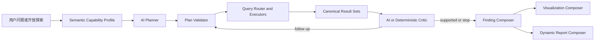

# Wyn 自主数据分析智能体 V2.1 产品设计文档

> 文档状态：Implemented / Strict UAT Passed  
> 版本：2.1  
> 更新日期：2026-08-01  
> 关联需求：[PRODUCT_REQUIREMENTS_V2_1.md](./PRODUCT_REQUIREMENTS_V2_1.md)

## 1. 设计目标

在保留 V2.0 CanonicalQueryRequest、QueryRouter、Adapter、CanonicalResultSet 和 Evidence Verifier 的前提下，将固定 Hypothesis Planner 与固定增长下钻改造成可审计的 Planner—Executor—Critic 循环。

## 2. 目标架构



AI 负责提出和调整分析路径；程序负责校验、执行、计算、证据绑定和预算控制。

## 3. 分层职责

### 3.1 Semantic Capability Profile

输入 Wyn 数据集元数据，输出：

```json
{
  "roles": {
    "time": ["订购日期"],
    "revenue": ["订单金额"],
    "profit": ["订单利润"],
    "customer": ["客户名称"],
    "product": ["商品名称"],
    "category": ["类别名称"],
    "region": ["客户地区"]
  },
  "capabilities": {
    "profitability": true,
    "customer": true,
    "product": true,
    "timeSeries": true
  },
  "semanticRisks": []
}
```

### 3.2 Planner

Planner 输入：

- 用户关注方向；
- Semantic Capability Profile；
- 字段名、类型、角色、描述和同义词；
- 用户过滤条件；
- 剩余查询、轮次和结果行数预算；
- 已执行查询指纹，防止重复。

Planner 输出：

```json
{
  "intent": "profitability",
  "summary": "先判断利润变化，再定位低利润业务实体",
  "hypotheses": [
    {
      "id": "hyp-profit-trend",
      "question": "利润与收入是否同向变化？",
      "businessValue": "区分规模增长与质量改善",
      "priority": 0.95,
      "requiredEvidence": ["月度收入与利润"]
    }
  ],
  "requests": [
    {
      "id": "qry-profit-trend",
      "hypothesisId": "hyp-profit-trend",
      "purpose": "比较月度收入与利润",
      "mode": "compare",
      "select": [{"field": "订购日期", "alias": "period", "grain": "month"}],
      "measures": [
        {"field": "订单金额", "aggregation": "sum", "alias": "revenue"},
        {"field": "订单利润", "aggregation": "sum", "alias": "profit"}
      ],
      "filters": [],
      "orderBy": [{"field": "period", "direction": "asc"}],
      "limit": 5000
    }
  ]
}
```

Planner 禁止输出底层执行语言。所有请求逐个经过 `normalizeCanonicalQueryRequest()`。

#### 3.2.1 最终规划决策

规划采用两级受控策略，并在运行记录中如实标识：

1. 首选 `ai-planner`：LLM 直接给出完整的 Canonical 查询需求，只有通过字段、聚合、过滤、预算和危险字段校验后才执行。
2. 完整计划无效时重试为 `ai-guided-planner`：LLM 只选择假设和分析方法，例如 `profit_trend`、`customer_concentration` 或 `product_portfolio`，确定性编译器再结合真实语义目录生成可执行的 `CanonicalQueryRequest`。
3. 非严格体验模式下，LLM 不可用或两级计划均失败时可进入 `deterministic-fallback` 并保存降级原因；严格模式立即保存 failed run，不执行 fallback。

因此，`ai-guided-planner` 表示“AI 选择探索方向和方法、受控编译器生成查询”，不等同于 AI 直接生成底层查询。Critic 仍可根据第一轮结果生成带血缘的、再次经过校验的 follow-up。

### 3.3 最小系统探针

以下能力由系统注入，不视为固定分析模板：

- `qry-system-quality`：受控质量样本，用于数据范围和完整度。
- `qry-system-overview`：完整数据集行数、收入、利润、日期范围等基础口径。

探针不直接决定后续探索主题，也不强制产生图表。

### 3.4 Critic

Critic 输入只包含查询请求、CanonicalResultSet 的 schema/statistics/有限聚合 rows、质量标记和假设，不包含 Token 或完整明细。

输出：

```json
{
  "assessments": [
    {
      "hypothesisId": "hyp-profit-trend",
      "status": "needs_followup",
      "reason": "最近期间利润与收入方向不一致，需要定位实体贡献",
      "triggerResultSetIds": ["rs-qry-profit-trend"]
    }
  ],
  "hypotheses": [],
  "requests": []
}
```

允许状态：`supported`、`rejected`、`inconclusive`、`needs_followup`。新增查询再次通过 Canonical 校验、重复指纹校验和预算校验。

### 3.5 Deterministic Fallback

仅在非严格体验模式下，LLM 不可用时使用问题关键词和 Semantic Capability Profile 选择能力包：profitability、customer、product、anomaly 或 open。降级仍然动态选择查询，不回到同一固定五图；运行记录必须包含：

```json
{
  "plannerMode": "deterministic-fallback",
  "plannerModel": null,
  "degradedReason": "..."
}
```

## 4. 执行状态机

```text
PROFILE_SEMANTICS
  -> PLAN_INITIAL
  -> VALIDATE_PLAN
  -> EXECUTE_ROUND
  -> CRITIQUE_RESULTS
  -> PLAN_FOLLOWUP | COMPOSE_FINDINGS
  -> COMPOSE_VISUALS
  -> COMPOSE_REPORT
  -> COMPLETE | PARTIAL | FAILED
```

停止条件：

- 达到 3 轮；
- 达到 10 个总查询；
- 没有 needs_followup；
- follow-up 与已执行查询重复；
- 结果为空或被截断到不支持进一步结论；
- 剩余假设价值低于阈值。

## 5. 通用 Finding Composer

### 5.1 单时间维度

- 生成时间序列 Finding；
- 计算最新变化、峰值和最大波动；
- 图表默认 line。

### 5.2 单业务维度

- 生成排名、集中度和头部贡献 Finding；
- 图表默认 bar；
- 只有存在 customer 语义时才标记为客户主题。

### 5.3 双指标结果

- 生成规模—质量组合 Finding；
- 首期前端可使用分组柱状或双序列折线；后续升级 scatter/quadrant。

### 5.4 双维度交叉结果

- 生成交叉贡献或变化来源 Finding；
- 首期可使用排序条形图；后续升级 heatmap。

所有 Finding 的 evidenceId 来自对应 ResultSet，不允许通过标题猜测证据。

### 5.5 数据质量与范围保护

- duration 语义字段出现负值时，原始值继续保留在 Evidence 中用于审计。
- 负时长从正常效率排名和图表有效序列中排除；如果某口径没有有效值，只生成数据质量 Finding。
- Evidence 在 `scope.invalidDurationFields`、`invalidDurationValueCount` 和 `durationPolicy` 中记录处理边界。
- `scope.resultLimited=true` 的证据不能支持无限定的全局最高、最低、所有、全部或唯一结论。
- 明确专项问题先做主题相关性裁剪，再交给受控方法编译器；结果驱动下钻仍由 Critic 决定。

### 5.6 结构化报告校验

- AI 报告固定输出 managementSummary、keyFindings、risks、actions 四个数组，每项必须引用白名单 evidence ID。
- 行动中的现状数字必须逐字存在于同一证据关联的洞察；无证据数字被拒绝。
- 即使数字有证据，也不得把它改写为目标、阈值或承诺。
- 含负时长证据不得直接生成正常效率排名；受限 TopN 必须显式限定返回范围。
- 严格模式报告两次校验仍失败时，run 状态为 failed，并保存有限的校验诊断，不生成本地假报告。
- 每个 `scope.invalidDurationFields` evidence 必须在报告中有独立的负值异常、排除和核验边界披露；正常排名不得复用该 evidence ID。
- 数值实体上下文校验忽略日期中的年/月/日数字，避免日历数字与指标值偶然相同造成误判。

## 6. LLM 安全边界

- Planner 和 Critic 使用低温度结构化 JSON。
- 请求只包含元数据、用户问题和聚合结果摘要。
- AI 返回内容先解析，再经过严格 Canonical 校验。
- AI 请求不能指定 adapter。
- 原始 SQL、WAX、query、payload、pivotPayload 字段继续由 Schema 拒绝。
- AI 失败时保存错误摘要，不保存 API Key 和完整上游响应。
- 严格 UAT 保存 Planner、Critic、查询和报告阶段的失败 run；fallback、partial、warning 与空报告均为阻断结果。
- 已授权的阿里云 DashScope 请求只包含元数据、语义、聚合摘要和报告上下文；不发送 Wyn Token、LLM API Key 或完整明细。

## 7. 代码变更

```text
lib/
  semantics/
    capability-profiler.mjs
  planning/
    exploration-planner.mjs
  analytics/
    exploration-artifacts.mjs
  harness/
    orchestrator.mjs
  llm/
    exploration-agent.mjs
  report/
    structured-report.mjs
```

`server.mjs` 创建受控 LLM Planner/Critic 并注入 Orchestrator；没有配置时注入空实现。非严格模式可使用 deterministic fallback，严格模式必须失败并保存诊断。

## 8. 测试策略

### 8.1 单元测试

- 语义能力画像识别。
- 五类意图产生差异化查询。
- AI JSON 计划合法化与恶意字段拒绝。
- 查询指纹去重与预算裁剪。
- 通用 Finding/Chart 与 ResultSet 证据绑定。

### 8.2 Harness 测试

- 注入 Fake AI Planner，验证自定义查询实际执行。
- 注入 Fake Critic，验证结果触发 follow-up。
- 非严格模式 LLM 失败后明确 deterministic-fallback；严格模式验证失败 run 且不执行 fallback。
- 不同 focus 的查询集合不同。
- 负时长不得进入正常排名和图表。
- 报告无证据数字、定量目标、受限范围外推和负时长误解读必须被拒绝。

### 8.3 真实 UAT

- 在同一 Wyn 销售数据集执行利润、客户、产品、异常、开放探索五个场景。
- 比较 intent、hypothesis IDs、query IDs、字段、图表和报告章节。
- 保存 UAT 运行 ID、耗时、Planner 模式和失败/降级原因。
- 对最新批次执行人工 run/报告审计，不能只依赖 evidenceCoverage 或自动化 PASS 数。
- 最终批次已完成 `9/9` 独立审计；后续变更必须重新执行该审计。

## 9. 迁移与兼容

- V1 API 不变。
- V2 API 路径保持不变，运行对象版本升级为 `analysis-run/v2.1`。
- V2.0 历史 JSON 继续可读。
- 前端对不存在的新审计字段使用兼容默认值。
- 报告导出继续支持 HTML、Markdown、JSON。


# 数据洞察阶段 1 产品补充`n`n数据洞察工作台现在区分“结果输入”和“洞察运行”：列表展示标准输入，运行对象记录 interpret/explore 模式、阶段状态、重试次数和错误原因，为后续 Evidence Pack 与 LLM 编排提供统一承载。


阶段 4/5/6 补充：数据洞察工作台按运行状态和模式呈现，权限边界来自受信请求身份；同一 Evidence/Skill/Report 组件服务 interpret 与 explore。

## 智能问数展示策略补充（2026-08-27）

- 用户入口名称统一为“智能问数”；`smart-query` 内部路由、会话和协议名称保持兼容。
- 图表生成采用可读性门槛：可见维度超过 2 个，或指标超过 3 个时不生成图表，仅展示完整分页表格，并在结果详情中说明原因。
- 表格默认每页 100 行；工具栏和分页固定在表格外层，表格主体固定约 320px 高并支持纵向/横向滚动。完整结果不展示任何数据行数提示，只有明确截断时才提示结果可能不完整。
- 派生指标允许扩展内部查询范围（例如同比基期），但后处理后必须重算用户可见 `totalRowCount/returnedRowCount`；内部查询规模使用 `internalCalculationRowCount/internalReturnedRowCount` 单独记录，不得参与前端完整性提示。
- 语义解析必须保留用户明确列举的多层级产品维度；匹配多个候选时优先最长显式字段，不能因泛化词子串覆盖而静默删除维度。
