# 通用模板报告平台需求、架构与实施规划

> 文档版本：0.2（MVP 实施基线）  
> 更新日期：2026-08-22  
> 文档状态：MVP 已实现 / 高保真 Office 能力待后续迭代评审  
> 适用范围：月报、检测报告、审查报告、经营分析报告及其他 Word 模板驱动报告

## 1. 文档目的

本文档定义一套与行业无关的“模板驱动报告生成平台”，用于后续：

- 确认需求边界和产品定位；
- 拆分 MVP、后续版本和不承诺能力；
- 统一模板解析、业务语义、数据查询、AI 内容和 Word 输出的技术契约；
- 跟踪需求、开发任务、迭代验收和风险；
- 作为设计评审、接口评审和测试用例的共同基线。

本文档不是某个行业模板的实施方案。销售、生产、石油、电力、航空等行业应通过数据集语义、指标口径和模板绑定配置适配，而不是分别开发一套报告程序。

## 2. 需求复核与产品定义

### 2.1 需求理解

用户希望上传 Word 模板或历史参考报告，平台识别其中的固定内容和需要动态生成的内容，并将业务数据、计算指标、动态表格、图表和 AI 洞察合并到模板中，生成可下载的 Word 报告。

与最初定义相比，本次反馈增加了三个关键能力：

1. **用户参与模板理解**：用户可以选中 Word 中的段落、句子、表格、单元格或图片位置，使用业务语言说明“这里统计本月销售额”“这里列出各区域完成率”，平台再把业务描述转换为受控查询需求。用户不需要知道数据集名称、字段名或 WAX/SQL。
2. **生成后在线编辑**：自动生成的正文、表格、图表说明和 AI 内容可以在网页中调整，用户确认后再合并到报告并导出 Word。
3. **AI 块多轮协作**：AI 洞察、风险判断和行动建议不是一次性文本。用户可以继续追问、要求改写、限定口径、补充背景或直接手工修改，直到形成认可版本，再写回对应章节。

### 2.2 产品定义

本产品定义为：

> **通用模板报告编排平台**：以 Word 模板为版式载体，以统一业务查询协议为数据供应层，以确定性计算和证据链保证数字正确，以 AI 和用户协作完成语义绑定与自然语言内容，最终生成可审计、可编辑、可导出的报告。

产品不定义为“任意 Word 无需确认即可自动生成”。无标记模板的自动识别应输出候选和置信度，涉及正式数字、指标口径和业务结论时必须允许用户确认。

### 2.3 可行性结论

整体可行，且当前项目已有重要基础：

- `lib/planning/query-request-schema.mjs` 已实现受控 `CanonicalQueryRequest` 校验；
- `lib/query/router.mjs` 和适配器已实现查询路由；
- `lib/query/result-normalizer.mjs` 已实现统一 `CanonicalResultSet`；
- `lib/analysis-core.mjs`、`lib/analytics/*` 已实现确定性指标、图表和发现；
- `lib/report/structured-report.mjs` 已实现 AI 报告证据引用和数字边界校验；
- `lib/report-export.mjs` 已实现 HTML、Markdown、JSON 报告导出。

新增工作主要集中在 DOCX/OOXML 模板解析、模板中间模型、用户绑定工作台、Word 原格式回填、在线编辑和多轮协作状态管理。

## 3. 设计原则与边界

### 3.1 设计原则

1. 业务用户使用业务语言，系统负责将其解析为技术查询。
2. AI 提出候选意图、查询需求和文本，程序负责校验、执行、计算、证据绑定和预算。
3. 数字由数据查询或确定性公式产生，AI 不得自由编造数字。
4. 模板版式、数据查询、内容生成和最终渲染解耦。
5. 每个动态内容必须可追溯到绑定、查询、结果集、公式和最终版本。
6. 自动识别允许不确定，但不能把不确定结果伪装成已确认事实。
7. 模板适配通过标准能力组合完成，不为单一行业写分支逻辑。

### 3.2 明确不承诺的能力

- 未标注、无语义上下文的任意 Word 100% 自动识别；
- 任意复杂 Word 对象（文本框、宏、嵌入式 OLE、复杂 SmartArt）的完全保真编辑；
- AI 直接输出或执行 SQL、WAX、Pivot Payload；
- 在没有数据证据时生成定量目标、阈值、承诺或事实；
- 首期跨多个数据源任意关联；
- 首期在服务端解决所有 Word 排版兼容性问题。

## 4. 用户角色与核心场景

### 4.1 角色

| 角色 | 主要职责 |
| --- | --- |
| 模板设计者 | 上传模板、确认动态区域、配置绑定和版式规则 |
| 业务分析人员 | 用业务语言描述统计口径、确认指标和 AI 内容 |
| 报告生成者 | 选择模板、数据集和期间，运行并审核报告 |
| 审核者 | 查看证据、审阅 AI 内容和用户修改，确认发布 |
| 平台管理员 | 管理数据集权限、模板版本、编辑器和外部 LLM 配置 |

### 4.2 典型流程

1. 上传 Word 模板或历史报告。
2. 系统解析段落、表格、页眉页脚、样式和候选动态内容。
3. AI 提供候选标注；用户选中任意区域并用业务语言补充说明。
4. 系统将描述转换为统一业务查询意图，解析为受控查询计划。
5. 用户预览查询结果和格式化值，确认绑定。
6. 保存模板版本和绑定规则。
7. 运行模板，执行查询、确定性计算、表格/图表生成和 AI 内容块生成。
8. 用户在网页中审阅并编辑生成内容；AI 块可多轮讨论。
9. 用户确认章节和整个报告。
10. 平台回填原 Word 模板，导出 DOCX；可选导出 HTML、PDF 或 JSON 审计包。

## 5. 模板识别与用户标注

### 5.1 三种识别模式

#### A. 显式标记（最高可靠性）

支持占位符、书签、内容控件和平台标记，例如：

```text
{{report_period}}
{{sales_amount}}
{{#each region_rows}}{{region_name}} {{revenue}} {{completion_rate}}{{/each}}
{{chart:monthly_sales}}
{{ai:management_summary}}
```

正式生产模板建议使用显式标记。平台应提供 Word 标记指南和可插入字段菜单。

#### B. AI 自动识别

解析文本、表格和样式后，AI 识别以下候选：

- 日期、期间、组织、负责人等参数；
- 金额、数量、百分比、比率等数值占位；
- “同比、环比、完成率、占比、达标率”等计算语义；
- 表头、明细行、合计行、分组行和交叉表结构；
- 可能的图表标题、图表数据区域和 AI 内容章节。

自动识别结果必须包含 `confidence`、推断理由和待确认项。

#### C. 用户选择和业务描述

用户可以选中：

- 一个或多个文字片段；
- 一个段落或标题；
- 表格、表格行、列或单元格；
- 图表占位区域；
- AI 洞察或行动建议章节。

用户只需输入“统计本月销售额”“按区域列出完成率”“找出利润下降的主要产品并给出行动建议”等业务描述。系统随后完成：

1. 业务意图识别；
2. 数据集候选匹配；
3. 字段和指标语义匹配；
4. 查询形状判断（单值、序列、分组表、交叉表、明细、图表）；
5. 计算口径建议；
6. 查询预览和证据说明。

用户不需要知道字段名、数据集 ID、WAX 或 SQL；技术字段映射只在“高级详情”中展示。

### 5.2 选择区域的稳定定位

Word 文本可能被拆分为多个 XML `run`，同样文字也可能重复出现。因此标注不能只保存原始字符串。模板解析时应为每个块生成稳定定位信息：

```json
{
  "blockId": "blk-para-0017",
  "part": "word/document.xml",
  "nodePath": "body/paragraph[17]",
  "textRange": { "start": 8, "end": 15 },
  "contentHash": "sha256:...",
  "anchorText": "本月销售额为"
}
```

回填前校验 `contentHash`。模板被修改后，系统应提示重新定位，禁止静默写入错误位置。

### 5.3 标注确认状态

每个候选动态块至少具有以下状态：

`discovered` → `proposed` → `needs-confirmation` → `confirmed` → `tested` → `published`。

未达到 `confirmed` 的绑定不能进入正式生产报告；预览可明确标识为草稿或待确认。

## 6. 统一 AI 查询与结果描述协议

### 6.1 关于“其他会话”信息

当前会话无法直接读取其他会话的历史内容，因此本节以仓库当前已经实现并测试的协议为准，提出项目级抽象。若另一会话已有更完整的字段定义，应在接口评审时合并为兼容版本，而不是另起一套查询协议。

### 6.2 三层协议

模板报告和智能问数应共用以下三层结构：

1. **BusinessQueryIntent**：面向业务语言的需求描述，不要求用户提供技术字段。
2. **CanonicalQueryRequest**：平台无关、可校验、不可包含 SQL/WAX 的受控查询请求。
3. **CanonicalResultSet / ResultDescription**：统一结果、范围、质量、来源和展示建议。

### 6.3 BusinessQueryIntent

建议项目级定义如下：

```json
{
  "protocolVersion": "business-query/v1",
  "intentId": "bqi-sales-monthly-001",
  "businessQuestion": "统计本月销售额和较上月变化",
  "userLanguage": "zh-CN",
  "context": {
    "reportPeriod": { "type": "month", "value": "2026-07" },
    "organization": null,
    "filters": []
  },
  "expectedResult": {
    "shape": "scalar-with-comparison",
    "fields": ["current_value", "previous_value", "change_value", "change_rate"],
    "maximumRows": 10
  },
  "presentation": {
    "targetBlockType": "inline-text",
    "format": "currency",
    "unit": "万元",
    "precision": 2
  },
  "semanticCandidates": [],
  "requiresUserConfirmation": true
}
```

`BusinessQueryIntent` 可以由用户描述、模板上下文和 AI 生成；它不能直接执行，必须由服务端结合语义目录编译为 `CanonicalQueryRequest`。

### 6.4 CanonicalQueryRequest（现有项目共通基线）

当前项目已实现的请求核心结构如下，模板报告必须复用，不应另造模板专用查询语言：

```json
{
  "id": "qry-sales-monthly",
  "hypothesisId": null,
  "purpose": "比较本月和上月销售额",
  "mode": "compare",
  "topic": "baseline",
  "dataset": { "id": "dataset-sales", "revision": "rev-2026-08-01" },
  "select": [
    { "field": "销售日期", "alias": "period", "grain": "month" }
  ],
  "measures": [
    { "field": "销售额", "aggregation": "sum", "alias": "sales" }
  ],
  "filters": [],
  "resultFilters": [],
  "fieldComparisons": [],
  "orderBy": [{ "field": "period", "direction": "asc" }],
  "limit": 24,
  "expectedResult": {
    "shape": "table",
    "maximumRows": 24
  },
  "sensitivity": "aggregate-only",
  "lineage": null
}
```

必须继续保持以下安全约束：

- 字段必须存在于当前数据集语义目录；
- 聚合只使用白名单操作；
- 不接受 `sql`、`wax`、`query`、`payload`、`pivotPayload`；
- 查询由服务端路由到受控适配器；
- 模板和 AI 都不能绕过 `normalizeCanonicalQueryRequest()`。

### 6.5 模板绑定到查询的关系

模板绑定不应把底层查询复制进每个 Word 节点，而应保存一个可复用的查询引用：

```json
{
  "bindingId": "bind-sales-amount",
  "blockId": "blk-para-0017",
  "businessIntent": { "...": "..." },
  "queryRequestId": "qry-sales-monthly",
  "valuePath": "rows[0].sales",
  "formula": null,
  "format": { "type": "number", "unit": "万元", "precision": 2 },
  "emptyPolicy": "show-dash",
  "evidenceRequired": true,
  "status": "confirmed"
}
```

一个查询可以服务多个绑定；一个表格或图表也可以引用同一结果集的不同字段。

### 6.6 CanonicalResultSet / ResultDescription

当前项目已经统一结果集的 `schema`、`rows`、`statistics`、`scope`、`provenance` 和 `quality`。模板报告使用时，建议在其外层增加报告展示描述，不修改底层结果集：

```json
{
  "resultSet": {
    "id": "rs-qry-sales-monthly",
    "requestId": "qry-sales-monthly",
    "schema": [
      { "name": "period", "sourceField": "销售日期", "type": "date", "role": "dimension", "grain": "month" },
      { "name": "sales", "sourceField": "销售额", "type": "number", "role": "measure", "aggregation": "sum" }
    ],
    "rows": [],
    "statistics": {},
    "scope": { "filters": [], "timeRange": null, "aggregationLevel": ["period"] },
    "provenance": { "adapter": "wyn-wax-controlled", "executedAt": "2026-08-22T00:00:00.000Z" },
    "quality": { "isSample": false, "isTruncated": false, "isEstimated": false, "warnings": [] }
  },
  "description": {
    "shape": "time-series",
    "primaryMeasure": "sales",
    "dimension": "period",
    "display": { "chartType": "line", "sort": "asc", "limit": 24 },
    "evidenceId": "ev-template-sales-monthly"
  }
}
```

### 6.7 支持的结果形状

首期至少支持：

| 形状 | 示例 | 目标块 |
| --- | --- | --- |
| `scalar` | 本月销售额 | 内联文本、KPI |
| `scalar-with-comparison` | 本月销售额、环比 | 内联文本、KPI |
| `time-series` | 月度销售趋势 | 表格、折线图 |
| `grouped-table` | 各区域收入和完成率 | 分组表、柱状图 |
| `detail-table` | 订单明细 | 明细表 |
| `matrix` | 区域 × 产品交叉统计 | 交叉表、热力图 |
| `ai-narrative` | 管理摘要、风险、行动建议 | AI 内容块 |

派生指标如同比、环比、完成率、利润率应由确定性公式层计算，并保存输入结果集和公式版本。

## 7. 模板中间模型

### 7.1 TemplatePackage

```json
{
  "templateId": "tpl-monthly-sales",
  "version": 3,
  "source": {
    "filename": "月报模板.docx",
    "sha256": "sha256:...",
    "uploadedAt": "2026-08-22T00:00:00.000Z"
  },
  "parts": ["word/document.xml", "word/header1.xml", "word/footer1.xml"],
  "blocks": [],
  "bindings": [],
  "styles": {},
  "compatibility": { "level": "standard", "warnings": [] }
}
```

### 7.2 Block 类型

- `fixed-text`：平台不替换的内容；
- `parameter`：期间、组织、编号等运行参数；
- `inline-text`：固定句子中嵌入单值或派生值；
- `scalar`：独立 KPI 或数字；
- `repeat-table`：按结果集重复行；
- `grouped-table`：按维度分组并可插入合计行；
- `matrix-table`：动态行列交叉表；
- `chart`：图表数据和图表标题/说明；
- `ai-narrative`：摘要、洞察、风险、行动建议；
- `manual-content`：用户确认后的自由编辑内容。

### 7.3 内联动态文本

动态值可以嵌入固定文本中，不能只支持整段替换：

```json
{
  "blockId": "blk-para-0017",
  "type": "inline-text",
  "segments": [
    { "type": "text", "value": "本月销售额为" },
    { "type": "binding", "bindingId": "bind-sales-amount" },
    { "type": "text", "value": "万元，较上月" },
    { "type": "binding", "bindingId": "bind-sales-mom" },
    { "type": "text", "value": "。" }
  ]
}
```

## 8. Word 解析、渲染与在线编辑方案

### 8.1 DOCX 处理策略

DOCX 本质是 OOXML 压缩包。建议采用“保留原 DOCX、定点修改 XML”的主方案：

- 读取 `document.xml`、页眉、页脚、样式和关系文件；
- 将段落、表格和图形位置映射为 Block；
- 替换文本节点时处理跨 `run` 的占位符；
- 重复表格行时复制并替换 XML 节点；
- 图表位置使用关系文件插入 PNG/SVG 或更新图表数据；
- 输出前运行 XML 完整性和 OOXML 打包校验。

HTML 转 Word 可作为预览或降级导出，但不应作为保留原版式的主路径。

### 8.2 在线预览与标注工作台

模板设计阶段可将 DOCX 转换为可选择的网页预览，给每个 Block 注入 `data-block-id`，支持选中区域、添加业务描述、查看 AI 候选和预览查询结果。预览层不应直接覆盖原始 DOCX。

### 8.3 在线编辑选项评估

| 方案 | 适用性 | 主要问题 |
| --- | --- | --- |
| ONLYOFFICE Docs | 高保真 Word 编辑、协作和 DOCX 回写 | 需要独立服务和集成，商业/社区许可需评估 |
| Collabora Online | 基于 LibreOffice 的在线 Office 编辑 | 部署、WOPI 集成和版式差异需评估 |
| docx-preview 等渲染库 | 预览和选择 | 不能提供完整 Word 编辑能力 |
| ProseMirror/Tiptap/Lexical | 结构化网页编辑 | 不是原生 DOCX 编辑，复杂版式回写成本高 |
| 自研 HTML 编辑器 | MVP 的 AI 块编辑 | 无法保证原 Word 版式完全保真 |

建议采用分层方案：

1. **MVP**：平台网页预览 + 动态块编辑器 + AI 内容编辑 + 服务器 OOXML 回填；
2. **正式高保真编辑**：集成 ONLYOFFICE 或 Collabora，提供“打开原始 Word / 在线编辑 / 保存回文档”能力；
3. 两类编辑均保存操作版本和差异，最终导出前执行模板完整性检查。

不能把 `contenteditable` 的 HTML 结果直接当成 Word 原文保存，否则表格、分页、页眉页脚和样式容易丢失。

### 8.4 用户修改的内容状态

所有可编辑内容都应标记来源：

- `system-calculated`：程序计算；
- `ai-generated`：AI 初稿；
- `user-edited`：用户修改；
- `user-confirmed`：用户确认发布；
- `stale`：数据或模板变化后需要重新确认。

用户手工修改动态数字时，系统应提示“该值已脱离自动计算”，并允许恢复为最新计算值。正式发布前可配置是否禁止修改数值型块。

## 9. AI 内容块的多轮协作

### 9.1 AI 块类型

- 管理摘要；
- 关键发现；
- 风险判断；
- 行动建议；
- 图表解读；
- 章节结论；
- 数据质量说明。

### 9.2 多轮交互流程

1. 系统根据已确认的查询结果集和证据生成 AI 初稿。
2. 用户可提出“突出利润下降原因”“不要使用客户名称”“行动建议更具体”“把语气改为审查报告”等要求。
3. AI 只接收该块关联的证据、上下文和对话摘要，不接收密钥或不受控明细。
4. 输出必须通过结构化解析、证据引用、数字支持、范围和敏感信息校验。
5. 用户可以接受、继续讨论、恢复上一个版本或直接编辑。
6. 用户确认后生成 `contentVersion`，绑定到模板章节。

### 9.3 内容协作对象

```json
{
  "contentBlockId": "ai-management-summary",
  "conversationId": "conv-tpl-run-001-summary",
  "messages": [],
  "drafts": [
    {
      "version": 2,
      "source": "ai-generated",
      "text": "...",
      "evidenceIds": ["ev-profit-trend"],
      "createdAt": "2026-08-22T00:00:00.000Z"
    }
  ],
  "selectedVersion": 2,
  "status": "user-confirmed"
}
```

### 9.4 AI 安全和真实性

沿用现有 `structured-report` 约束：

- 每条数值结论必须引用允许的 evidence ID；
- 受限 TopN 不能外推为全量结论；
- 负值、异常时长等数据质量边界必须披露；
- 行动建议中的现状数字必须能在同一证据关联的洞察中找到；
- AI 不得把现状数字改写成未经验证的目标、阈值或承诺；
- AI 失败、校验失败或用户未确认时，报告状态不得标记为正式发布。

## 10. 端到端系统架构

```mermaid
flowchart LR
    U[用户上传 Word/业务描述] --> P[DOCX Parser]
    P --> M[Template Intermediate Model]
    M --> A[AI Candidate Annotator]
    U --> W[Annotation & Binding Workbench]
    A --> W
    W --> I[BusinessQueryIntent]
    I --> C[Semantic Resolver / Query Compiler]
    C --> Q[CanonicalQueryRequest]
    Q --> R[Query Router + Controlled Adapters]
    R --> S[CanonicalResultSet]
    S --> F[Deterministic Formula & Evidence]
    F --> G[Table/Chart Composer]
    F --> N[AI Narrative Conversation]
    N --> V[Validation & User Confirmation]
    G --> T[DOCX Composer]
    V --> T
    T --> O[DOCX / HTML / JSON Export]
```



建议新增模块：

```text
lib/template/
  docx-parser.mjs
  template-model.mjs
  binding-resolver.mjs
  docx-composer.mjs
  template-validation.mjs
lib/reporting/
  business-query-intent.mjs
  formula-engine.mjs
  content-session.mjs
  report-runner.mjs
```

具体命名可根据代码库现有风格调整，但查询编译应复用 `lib/planning` 和 `lib/query`，不在模板模块内复制查询执行逻辑。

## 11. 核心数据对象

### 11.1 Template

保存原始文件、解析版本、兼容性、Block 和绑定。

### 11.2 Binding

保存 Block 定位、业务意图、查询引用、结果路径、公式、格式化和确认状态。

### 11.3 Formula

只允许白名单公式，例如：

- `ratio(a, b)`；
- `change(current, previous)`；
- `percentage(part, total)`；
- `difference(current, previous)`；
- `sum(rows[field])`。

公式必须有输入绑定、单位、精度、除零策略和版本号，禁止执行任意 JavaScript。

### 11.4 ReportRun

关联模板版本、数据集 revision、运行参数、查询请求、结果集摘要、公式版本、AI 内容版本、编辑记录、导出文件和状态。

推荐状态：

`draft` → `binding-review` → `data-running` → `content-review` → `user-edited` → `confirmed` → `exported`。

### 11.5 Evidence

每个单值、表格、图表和 AI 内容块都要关联证据 ID。模板报告的证据必须能够回到：

`Binding → CanonicalQueryRequest → CanonicalResultSet → Formula/Finding → RenderedBlock`。

## 12. 接口草案

| 接口 | 作用 |
| --- | --- |
| `POST /api/report-templates` | 上传 DOCX 并创建模板 |
| `GET /api/report-templates/:id` | 获取模板解析结果、Block 和绑定 |
| `POST /api/report-templates/:id/annotate` | 用户对选区添加业务描述 |
| `POST /api/report-templates/:id/bindings/propose` | AI 提议字段、查询和公式绑定 |
| `POST /api/report-templates/:id/bindings/validate` | 预览并校验绑定 |
| `PUT /api/report-templates/:id/bindings/:bindingId` | 用户确认或修改绑定 |
| `POST /api/report-runs` | 使用模板、数据集和参数生成报告运行 |
| `GET /api/report-runs/:id` | 获取运行、结果、证据和内容状态 |
| `POST /api/report-runs/:id/content/:blockId/messages` | AI 块多轮讨论 |
| `PUT /api/report-runs/:id/content/:blockId` | 用户编辑或确认内容 |
| `POST /api/report-runs/:id/preview` | 生成网页预览 |
| `GET /api/report-runs/:id/export?format=docx` | 导出 Word |

接口必须沿用当前服务端鉴权、数据集权限和不向浏览器暴露 Token 的原则。

## 13. 版本、审计与一致性

报告结果依赖四类版本，必须同时保存：

1. 模板版本；
2. 数据集 revision；
3. 查询/公式协议版本；
4. AI 内容版本和用户确认版本。

如果模板、数据集或公式发生变化，旧报告仍可下载，但再次打开时应显示“可复现版本”和“当前版本存在差异”。

所有用户确认、AI 生成、手工编辑、恢复和导出事件都应写入审计记录。审计记录不得保存密钥和不必要的完整明细。

## 14. 分阶段实施计划

### Phase 0：协议与技术验证

目标：验证 DOCX 解析、定位、占位符替换和统一查询协议。

- 明确 `BusinessQueryIntent` 和 `ResultDescription` 的 JSON Schema；
- 选取 3 种不同结构的 Word 模板；
- 完成 DOCX OOXML 解析 POC；
- 验证跨 `run` 文本替换、表格复制和图表图片插入；
- 复用现有 Canonical 查询执行一个单值和一个分组表；
- 确认 ONLYOFFICE/Collabora 的部署、许可证和数据隔离要求。

验收：原始模板版式基本保留，生成的单值和表格可在 Word 中打开，查询不接受任意 WAX/SQL。

### Phase 1：模板上传、识别和绑定 MVP

- 上传 DOCX；
- 解析段落、表格和基本样式；
- 显式占位符；
- AI 候选识别；
- 用户选区和业务描述；
- 单值、内联文本和简单重复表；
- 查询预览、字段/公式确认；
- 模板版本保存。

### Phase 2：报告运行与 Word 输出

- 运行参数和数据集选择；
- 单值、内联文本、分组表、明细表；
- 确定性公式和证据链；
- 图表 PNG/SVG 插入；
- DOCX 导出和审计 JSON；
- 空值、截断、数据质量和失败状态。

### Phase 3：网页编辑和 AI 多轮协作

- 动态块网页编辑；
- AI 摘要、风险、行动建议；
- 对话历史、草稿版本、用户修改和确认；
- 内容证据校验；
- 报告章节重新生成和局部刷新；
- 生成前后的差异查看。

### Phase 4：高保真 Office 编辑与复杂表格

- 集成 ONLYOFFICE 或 Collabora；
- 复杂表格、交叉表和合计规则；
- 页眉页脚、目录和复杂样式增强；
- 多数据集受控关联；
- 批量报告、定时任务和审批流。

## 15. MVP 范围建议

首个可交付版本建议严格控制为：

- DOCX 模板上传；
- 固定文本和显式占位符；
- 用户选区 + 业务描述；
- 单值指标、内联动态文本、简单重复表；
- 复用一个数据集和现有 Canonical 查询能力；
- 确定性计算和证据引用；
- AI 内容块初稿、用户编辑和确认；
- 服务器端 DOCX 输出；
- HTML 预览、JSON 审计和 Word 下载。

首期暂不把“完整 Word 在线编辑器”作为硬依赖。这样可以先验证模板绑定和报告生成的核心价值，再决定 Office 编辑器集成的部署与许可成本。

## 16. 验收标准

### 16.1 模板识别与绑定

- 能解析至少 3 种不同版式的 DOCX；
- 跨 Word `run` 的占位符可正确替换；
- 用户选区能够稳定定位到 Block；
- 用户用“统计本月销售额”等业务语言即可生成候选查询；
- 未确认绑定不会进入正式发布状态；
- 绑定可展示字段、聚合、期间、过滤、公式和格式化规则。

### 16.2 查询与结果

- 模板报告和智能问数使用同一 `CanonicalQueryRequest`；
- 浏览器和 LLM 不能提交 SQL、WAX 或任意执行 Payload；
- 单值、时间序列、分组表和明细表结果均有统一 schema、scope、quality 和 provenance；
- 结果可以回溯到数据集 revision 和执行计划；
- 计算指标具备公式版本和输入证据。

### 16.3 AI 与用户协作

- AI 候选包含置信度和推断理由；
- AI 洞察、风险和行动建议可以多轮讨论；
- 用户可以接受 AI 草稿、继续追问、手工修改、恢复历史版本；
- AI 数字无证据、越界结论和未经验证目标会被阻断；
- 用户确认后的内容能绑定到指定 Word 章节。

### 16.4 导出与编辑

- 生成的 DOCX 可被 Microsoft Word 正常打开；
- 原模板的主要字体、段落、表格边框、页眉页脚和分页基本保留；
- 动态表格可按行扩展，空结果有明确策略；
- 用户修改内容能在导出文件中体现；
- 报告可显示模板版本、数据版本、生成时间和内容确认状态；
- 生成失败时不产生“看似成功”的正式报告。

## 17. 测试计划

### 单元测试

- DOCX Block 解析和跨 `run` 占位符；
- 选区锚点和内容 hash 校验；
- BusinessQueryIntent 到 CanonicalQueryRequest 的编译；
- 公式计算、单位、精度和除零策略；
- ResultDescription 和表格/图表数据映射；
- AI 内容证据和数字校验。

### 集成测试

- 模板上传 → 标注 → 查询预览 → 确认 → 运行 → 导出；
- 同一结果集被单值、表格和图表同时引用；
- 模板版本或数据集 revision 改变后的 stale 检测；
- 查询失败、AI 失败、Word 回填失败的状态和审计；
- ONLYOFFICE/Collabora 回调和文档权限（如启用）。

### 真实验收

至少准备：

- 经营月报；
- 生产检测报告；
- 审查/合规报告；

三类模板，验证同一平台通过不同语义和绑定适配，而不是依赖模板名称或行业分支。

## 18. 主要风险与应对

| 风险 | 影响 | 应对 |
| --- | --- | --- |
| Word 复杂对象兼容性 | 高 | 定义兼容级别，优先标准段落/表格，复杂对象采用 Office 编辑器 |
| 自动识别错误 | 高 | AI 只提议，用户确认；高风险数字必须有证据 |
| 业务口径不明确 | 高 | 先展示查询预览、公式和样例结果，再允许确认 |
| 在线编辑集成成本 | 中高 | MVP 先编辑动态块，Phase 4 再接 ONLYOFFICE/Collabora |
| 生成报告与原模板版式偏差 | 中高 | OOXML 定点修改、回归样本、Word 打开校验和视觉测试 |
| AI 内容版本混乱 | 中 | 内容版本、对话版本、用户确认版本分离保存 |
| 数据权限和外发 | 高 | 服务端执行、最小摘要外发、权限检查和审计 |

## 19. 待评审决策

1. 首期是否只支持标准段落、表格、页眉页脚，复杂文本框是否延期？
2. 正式高保真在线编辑选择 ONLYOFFICE、Collabora，还是先不集成？
3. 模板是否允许跨多个数据集，还是首期坚持单数据集？
4. 用户手工修改自动计算数字时，是允许并标记，还是直接禁止？
5. 报告发布是否需要审核者确认和审批流？
6. `BusinessQueryIntent` 与另一会话中已有查询 JSON 是否需要通过兼容字段合并？
7. 生产环境报告文件和运行记录使用数据库、对象存储还是现有 JSON 存储的过渡方案？

## 20. 当前结论

本需求应作为现有 AI 数据分析平台的上层报告编排能力建设。最重要的复用点不是 HTML 报告页面，而是现有的语义目录、Canonical 查询协议、结果标准化、确定性计算、证据链和 AI 内容校验。

推荐的最小闭环是：

> Word 模板上传 → AI 候选识别 → 用户用业务语言确认 → BusinessQueryIntent → CanonicalQueryRequest → CanonicalResultSet → 确定性计算/证据 → AI 多轮内容 → 用户确认 → OOXML 回填 → DOCX 下载。

只要坚持这个闭环，平台既能适配不同模板和行业，又能保留数字准确性、用户控制权、在线协作能力和最终报告的可审计性。

## 21. MVP 实施状态（2026-08-22）

本节把需求基线与当前代码和 UAT 对齐，避免规划文档与实际交付状态脱节。

### 21.1 已交付能力

| 能力 | 当前实现 | 验证证据 |
| --- | --- | --- |
| 模板上传和解析 | `POST /api/report-templates`；标准段落、表格、页眉页脚、占位符、稳定 Block ID 和内容 Hash | `test/uat-artifacts/template-report/latest.json` UAT-TR-01 |
| 用户参与标注 | `POST /api/report-templates/:id/annotate`；保存选区、业务描述、内容 Hash 校验 | UAT-TR-02 |
| 业务语言查询提议 | BusinessQueryIntent → CanonicalQueryRequest；字段、聚合、维度、时间粒度和结果形状受控校验 | UAT-TR-02；`test/template-report.test.mjs` |
| 模板绑定和版本 | TemplatePackage/Binding v1 持久化、确认状态、审计事件 | UAT-TR-03；`data/report-templates/` |
| 确定性计算 | `ratio`、`change`、`percentage`、`difference`、`sum` 白名单公式，除零策略和证据引用 | `test/template-report.test.mjs`；UAT-TR-03 |
| 动态输出 | 动态段落、内联文本、重复/分组表、矩阵表、SVG 图表关系插入；保留原 DOCX ZIP 结构 | UAT-TR-04；生成物 `generated-report.docx` |
| AI 内容块 | AI 洞察初稿、多轮讨论、手工编辑、版本和用户确认；内容只接收关联证据 | UAT-TR-05 |
| 在线编辑 | 网页动态块工作台：上传、Block 选择、业务描述、绑定、运行、内容编辑、确认、下载 | 桌面和 390×844 浏览器实测 |
| 审计和导出 | ReportRun v1、证据、查询结果集和 JSON 审计导出；Word 下载 | `data/report-runs/`；UAT-TR-04 |

### 21.2 本次明确未承诺

- 完整 Word 在线编辑、复杂文本框、SmartArt、OLE、宏和复杂版式对象；
- 任意明细级多数据集 Join；当前多数据集仍使用受控维度对齐合并；
- 固定服务端 Token 的终端用户身份代理和行级权限双账号实测；
- 严格外部 LLM 在网络不可达时的成功验收；严格模式会返回失败并保留原因；
- 无 LibreOffice 环境下的最终 PNG 渲染确认；结构校验已完成，但正式部署需补齐渲染机。

### 21.3 后续迭代入口

1. 接入 ONLYOFFICE 或 Collabora，并保存 WOPI/编辑版本和差异；
2. 增加异步长查询、批量报告、审批和定时任务；
3. 完成终端用户身份代理、双账号行级权限和非索引数据集能力矩阵；
4. 扩展跨数据集关联模型、指标资产中心和向量知识库；
5. 为生产渲染机补充 `render_docx.py` PNG 回归，并将页面差异纳入发布门禁。
